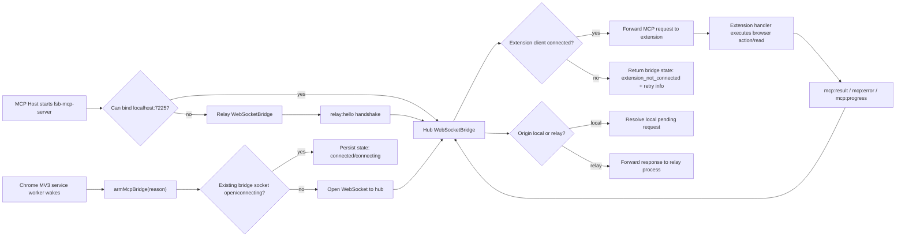

# Phase 198: MCP Bridge Lifecycle & Reconnect State - Research

**Researched:** 2026-04-22 [VERIFIED: environment current_date]
**Domain:** Chrome MV3 service-worker WebSocket lifecycle plus Node MCP WebSocket hub/relay topology [VERIFIED: .planning/ROADMAP.md]
**Confidence:** HIGH for codebase topology and nearest tests; MEDIUM for live browser lifecycle until Chrome smoke/UAT is added. [VERIFIED: source inspection + command output]

## User Constraints

No `*-CONTEXT.md` exists for this phase, so implementation decisions are agent discretion constrained by `STATE.md`, `ROADMAP.md`, `REQUIREMENTS.md`, and existing code patterns. [VERIFIED: `node /Users/lakshman/.codex/get-shit-done/bin/gsd-tools.cjs init phase-op 198`]

Locked phase scope: Phase 198 must make MCP attach without extension reload across browser-first, server-first, MV3 service-worker wake, and multi-host hub/relay recovery scenarios. [VERIFIED: .planning/ROADMAP.md]

Locked requirement IDs: `BRIDGE-01`, `BRIDGE-02`, `BRIDGE-03`, and `BRIDGE-04`. [VERIFIED: .planning/REQUIREMENTS.md]

Project-local `AGENTS.md`, `CLAUDE.md`, `.claude/skills/`, and `.agents/skills/` were not found in this repository checkout. [VERIFIED: `find . -name AGENTS.md -o -name CLAUDE.md`; `find .claude/skills .agents/skills -maxdepth 2 -name SKILL.md`]

## Project Constraints (from CLAUDE.md)

None, because no `CLAUDE.md` exists in the project root or below the searched tree. [VERIFIED: `find . -name CLAUDE.md`]

<phase_requirements>

## Phase Requirements

| ID | Description | Research Support |
|----|-------------|------------------|
| BRIDGE-01 | Start MCP host after Chrome/FSB is already open and attach without extension reload. [VERIFIED: .planning/REQUIREMENTS.md] | Extension reconnect timers currently live only in service-worker memory, so the plan must add wake-safe arming plus persisted bridge state. [VERIFIED: ws/mcp-bridge-client.js] |
| BRIDGE-02 | Open Chrome/FSB after an MCP host is already running and attach within a bounded reconnect window. [VERIFIED: .planning/REQUIREMENTS.md] | Server hub already listens on `ws://localhost:7225`, but extension startup/wake must call an idempotent connect path. [VERIFIED: mcp-server/src/bridge.ts + background.js] |
| BRIDGE-03 | Re-arm MCP bridge attempts whenever the MV3 service worker wakes or handles extension activity. [VERIFIED: .planning/REQUIREMENTS.md] | Current `mcpBridgeClient.connect()` calls appear only in `onInstalled` and `onStartup`; other wake handlers do not re-arm the bridge. [VERIFIED: `rg "mcpBridgeClient.connect" background.js`] |
| BRIDGE-04 | Multiple MCP hosts connect through hub/relay mode without stealing, orphaning, or permanently breaking extension connection. [VERIFIED: .planning/REQUIREMENTS.md] | Hub/relay code exists, but relay `connected` is set on `relay:welcome`, not on verified extension reachability. [VERIFIED: mcp-server/src/bridge.ts] |

</phase_requirements>

## Summary

Primary recommendation: implement this phase as a lifecycle/state repair, not as a tool-routing change. [VERIFIED: Phase 199 owns route-contract work in .planning/ROADMAP.md] Add a single idempotent extension-side `armMcpBridge(reason)` path, call it from top-level service-worker initialization and every wake event, persist concise bridge state, and use `chrome.alarms` as the wake-safe reconnect backstop because MV3 timers may be lost when the service worker terminates. [CITED: https://developer.chrome.com/docs/extensions/develop/migrate/to-service-workers] [VERIFIED: ws/mcp-bridge-client.js]

The server-side `WebSocketBridge` already implements first-process hub mode and later-process relay mode on port `7225`. [VERIFIED: mcp-server/src/bridge.ts] The key planning issue is semantic: a relay process currently becomes `connected` after hub handshake, even if the hub has no extension client, so downstream MCP tools may treat hub reachability as extension reachability. [VERIFIED: mcp-server/src/bridge.ts] The plan should split hub connectivity from extension reachability and broadcast topology state to relays. [VERIFIED: mcp-server/src/bridge.ts]

Validation needs new focused tests because the existing nearest MCP regression test is already failing 9 assertions and full-suite health has unrelated existing failures. [VERIFIED: `node tests/mcp-restricted-tab.test.js`; `node tests/runtime-contracts.test.js`] The plan should create deterministic Node tests for extension-client reconnect state and server hub/relay promotion before attempting live Chrome UAT. [VERIFIED: tests directory inspection]

**Primary recommendation:** Use the existing `ws` + MCP SDK stack; add lifecycle arming, alarm-backed reconnect, persisted bridge state, explicit topology state, and focused bridge lifecycle tests. [VERIFIED: package.json + mcp-server/package.json + source inspection]

## Architectural Responsibility Map

| Capability | Primary Tier | Secondary Tier | Rationale |
|------------|--------------|----------------|-----------|
| Extension attachment/reconnect | Browser / Client | API / Backend | The Chrome extension initiates the local WebSocket to `ws://localhost:7225`, so retry state starts in the MV3 service worker. [VERIFIED: ws/mcp-bridge-client.js] |
| Wake-path re-arming | Browser / Client | — | Extension events load/wake the service worker, and top-level listener registration is the MV3-safe pattern. [CITED: https://developer.chrome.com/docs/extensions/develop/migrate/to-service-workers] |
| Hub/relay ownership | API / Backend | Browser / Client | `fsb-mcp-server` owns the local WebSocket server or relay client role; the extension is only one client of the hub. [VERIFIED: mcp-server/src/bridge.ts] |
| Bridge status/diagnostics state | API / Backend | Browser / Client | Server diagnostics read bridge mode and extension reachability, while the extension should expose wake/reconnect state for accurate status. [VERIFIED: mcp-server/src/diagnostics.ts + ws/mcp-bridge-client.js] |
| MCP tool execution | API / Backend | Browser / Client | Tool registration and queueing live in `mcp-server/src/runtime.ts` and tool modules; actual browser actions execute in the extension. [VERIFIED: mcp-server/src/runtime.ts + ws/mcp-bridge-client.js] |

## Standard Stack

### Core

| Library / Platform | Version | Purpose | Why Standard |
|--------------------|---------|---------|--------------|
| Chrome Extension Manifest V3 service worker | Manifest uses MV3; installed Chrome is `147.0.7727.102`. [VERIFIED: manifest.json; `/Applications/Google Chrome.app/Contents/MacOS/Google Chrome --version`] | Browser-side bridge client and wake events. [VERIFIED: background.js + ws/mcp-bridge-client.js] | MV3 service workers are the project’s production extension background model. [VERIFIED: manifest.json] |
| `@modelcontextprotocol/sdk` | Installed `1.27.1`; npm latest `1.29.0`, published 2026-03-30. [VERIFIED: local node_modules + npm registry] | MCP stdio and Streamable HTTP server transports. [CITED: Context7 `/modelcontextprotocol/typescript-sdk`] | Existing MCP server uses `McpServer`, `StdioServerTransport`, and `StreamableHTTPServerTransport`. [VERIFIED: mcp-server/src/server.ts + mcp-server/src/index.ts + mcp-server/src/http.ts] |
| `ws` | Installed `8.19.0`; npm latest `8.20.0`, published 2026-03-21. [VERIFIED: local node_modules + npm registry] | Node WebSocket server/client for hub/relay bridge. [VERIFIED: mcp-server/src/bridge.ts] | Existing hub/relay code already uses `WebSocketServer` and `WebSocket` from `ws`. [VERIFIED: mcp-server/src/bridge.ts] |
| TypeScript | Installed `5.9.3`; npm latest `6.0.3`, published 2026-04-16. [VERIFIED: local node_modules + npm registry] | Type-check and build MCP server. [VERIFIED: mcp-server/tsconfig.json] | Existing MCP server source is TypeScript strict mode. [VERIFIED: mcp-server/tsconfig.json] |

### Supporting

| Library / Tool | Version | Purpose | When to Use |
|----------------|---------|---------|-------------|
| `zod` | Installed `3.25.76`; npm latest `4.3.6`, published 2026-01-22. [VERIFIED: local node_modules + npm registry] | Existing MCP tool schema validation. [VERIFIED: mcp-server/src/tools/schema-bridge.ts] | Do not change for this phase unless bridge status tools need new schemas. [VERIFIED: existing package.json] |
| `tsx` | Installed/latest `4.21.0`, published 2025-11-30. [VERIFIED: local node_modules + npm registry] | TypeScript dev runner. [VERIFIED: mcp-server/package.json] | Use only if tests need direct TS execution; current tests generally consume built JS. [VERIFIED: tests inspection] |
| `chrome.alarms` | Chrome API; permission already declared. [VERIFIED: manifest.json] | Wake-safe reconnect scheduling. [CITED: https://developer.chrome.com/docs/extensions/reference/api/alarms] | Use for reconnect persistence across service-worker termination. [CITED: https://developer.chrome.com/docs/extensions/develop/migrate/to-service-workers] |

### Alternatives Considered

| Instead of | Could Use | Tradeoff |
|------------|-----------|----------|
| `ws` hub/relay | Native messaging host | Native messaging can provide stronger keepalive, but this milestone explicitly targets the existing local WebSocket MCP bridge and not a helper process redesign. [VERIFIED: .planning/ROADMAP.md] |
| Alarm-backed reconnect | In-memory `setTimeout` only | In-memory timers are simpler, but MV3 service-worker termination can cancel them. [CITED: https://developer.chrome.com/docs/extensions/develop/migrate/to-service-workers] |
| Explicit topology state | Inferring from socket readyState | Socket readyState cannot distinguish relay-to-hub reachability from extension reachability. [VERIFIED: mcp-server/src/bridge.ts] |
| Raising Chrome minimum to 116 | Keep current Chrome `>=88` claim | Chrome 116 has improved service-worker WebSocket lifetime behavior, but changing browser support is product scope and should be confirmed. [CITED: https://developer.chrome.com/docs/extensions/how-to/web-platform/websockets] [VERIFIED: package.json] |

**Installation:**

```bash
# No new package is required for Phase 198.
npm --prefix mcp-server install
```

**Version verification:** `npm view @modelcontextprotocol/sdk version`, `npm view ws version`, `npm view zod version`, `npm view typescript version`, and `npm view tsx version` were run on 2026-04-22. [VERIFIED: npm registry]

## Architecture Patterns

### System Architecture Diagram



### Recommended Project Structure

```text
ws/
  mcp-bridge-client.js          # Extension lifecycle, reconnect, persisted bridge state [VERIFIED: existing file]
mcp-server/src/
  bridge.ts                     # Hub/relay topology and extension reachability [VERIFIED: existing file]
  diagnostics.ts                # Bridge state probes consumed by status/doctor [VERIFIED: existing file]
  types.ts                      # Relay/status message contracts [VERIFIED: existing file]
tests/
  mcp-bridge-client-lifecycle.test.js  # New VM/fake WebSocket extension lifecycle tests [RECOMMENDED]
  mcp-bridge-topology.test.js          # New real-ws hub/relay topology tests [RECOMMENDED]
```

### Pattern 1: Idempotent Extension Bridge Arming

**What:** Centralize extension-side reconnect startup in one safe function that records the wake reason, persists bridge state, and calls `mcpBridgeClient.connect()` only when the socket is not already open or connecting. [VERIFIED: ws/mcp-bridge-client.js]

**When to use:** Call this at service-worker top level and from every extension wake handler that already runs for FSB activity. [CITED: https://developer.chrome.com/docs/extensions/develop/migrate/to-service-workers]

**Example:**

```javascript
// Source: existing ws/mcp-bridge-client.js plus Chrome MV3 top-level listener guidance.
function armMcpBridge(reason) {
  if (!globalThis.mcpBridgeClient) return;
  mcpBridgeClient.recordWake?.(reason);
  mcpBridgeClient.connect();
}

armMcpBridge('service-worker-evaluated');

chrome.runtime.onStartup.addListener(() => {
  armMcpBridge('runtime.onStartup');
});

chrome.runtime.onMessage.addListener((request, sender, sendResponse) => {
  armMcpBridge('runtime.onMessage');
  // existing switch handler continues here
});
```

### Pattern 2: Alarm-Backed Reconnect Backstop

**What:** Keep the current short in-memory reconnect loop while the service worker is alive, and create a named `chrome.alarms` retry when disconnected so a later wake can retry even if `setTimeout` was canceled. [VERIFIED: ws/mcp-bridge-client.js] [CITED: https://developer.chrome.com/docs/extensions/reference/api/alarms]

**When to use:** Use when WebSocket connection fails, closes unintentionally, or service worker wakes and stored state says the last bridge state was not connected. [VERIFIED: ws/mcp-bridge-client.js]

**Example:**

```javascript
// Source: Chrome alarms persistence guidance + existing MCP reconnect constants.
const MCP_RECONNECT_ALARM = 'fsb-mcp-bridge-reconnect';

async function scheduleMcpReconnectAlarm(delayMs) {
  const delayInMinutes = Math.max(delayMs / 60000, 0.5);
  await chrome.alarms.create(MCP_RECONNECT_ALARM, { delayInMinutes });
}

chrome.alarms.onAlarm.addListener((alarm) => {
  if (alarm.name === MCP_RECONNECT_ALARM) {
    armMcpBridge('alarm:' + alarm.name);
  }
});
```

### Pattern 3: Explicit Hub/Relay State Contract

**What:** Track `mode`, `hubConnected`, `extensionConnected`, `relayCount`, `lastExtensionHeartbeatAt`, `lastDisconnectReason`, and `activeHubInstanceId` separately. [VERIFIED: mcp-server/src/bridge.ts]

**When to use:** Use for `bridge.isConnected`, `diagnostics`, relay welcome messages, hub broadcasts, and later `status --watch`. [VERIFIED: mcp-server/src/diagnostics.ts]

**Example:**

```typescript
// Source: existing WebSocketBridge mode plus relay hello/welcome protocol.
type BridgeState = {
  mode: 'hub' | 'relay' | 'disconnected';
  hubConnected: boolean;
  extensionConnected: boolean;
  relayCount: number;
  lastDisconnectReason?: string;
  activeHubInstanceId?: string;
};

get state(): BridgeState {
  return {
    mode: this.mode,
    hubConnected: this.mode === 'hub' ? Boolean(this.wss) : this.hubConnection?.readyState === WebSocket.OPEN,
    extensionConnected: this.connected,
    relayCount: this.relayClients.size,
    lastDisconnectReason: this.lastDisconnectReason,
    activeHubInstanceId: this.hubInstanceId,
  };
}
```

### Pattern 4: Testable Bridge Options

**What:** Add constructor options for `port`, `host`, reconnect delays, handshake timeout, and deterministic `instanceId` without changing CLI defaults. [VERIFIED: mcp-server/src/bridge.ts]

**When to use:** Use for Node lifecycle tests so they can run on ephemeral ports and short timeouts instead of hard-coded port `7225`. [VERIFIED: mcp-server/src/bridge.ts]

**Example:**

```typescript
// Source: existing WebSocketBridge constructor and PORT constant.
type BridgeOptions = {
  port?: number;
  host?: string;
  instanceId?: string;
  handshakeTimeoutMs?: number;
  promotionJitterMs?: number;
  maxReconnectDelayMs?: number;
};

const bridge = new WebSocketBridge({
  port: testPort,
  instanceId: 'test-hub',
  handshakeTimeoutMs: 25,
  promotionJitterMs: 5,
});
```

### Anti-Patterns to Avoid

- **Only adding more `connect()` calls to `onInstalled`/`onStartup`:** This misses MV3 wake paths such as messages, ports, alarms, action clicks, and webNavigation events. [VERIFIED: background.js]
- **Treating relay handshake as extension connectivity:** `relay:welcome` proves the hub exists, not that the extension is attached. [VERIFIED: mcp-server/src/bridge.ts]
- **Using `setInterval`/`setTimeout` as the only reconnect guarantee:** MV3 service-worker termination can cancel timers. [CITED: https://developer.chrome.com/docs/extensions/develop/migrate/to-service-workers]
- **Moving tool routing into this phase:** Route-contract repairs are Phase 199 scope. [VERIFIED: .planning/ROADMAP.md]

## Don't Hand-Roll

| Problem | Don't Build | Use Instead | Why |
|---------|-------------|-------------|-----|
| WebSocket server/client framing | Custom TCP protocol or manual HTTP upgrade handling | Existing `ws` package | `ws` already provides `WebSocketServer`, close/error events, ping/pong patterns, and termination helpers. [CITED: Context7 `/websockets/ws`] |
| MCP server transports | Custom JSON-RPC stdio/http handling | Existing `@modelcontextprotocol/sdk` | Existing runtime already uses MCP SDK server and transports. [VERIFIED: mcp-server/src/server.ts + mcp-server/src/index.ts + mcp-server/src/http.ts] |
| MV3 reconnect persistence | Global variables only | `chrome.storage.session`/`chrome.storage.local` plus `chrome.alarms` | Chrome docs say global state is unreliable across service-worker termination and alarms should replace long timers. [CITED: https://developer.chrome.com/docs/extensions/develop/migrate/to-service-workers] |
| Hub/relay election | Shelling out to `lsof` or OS locks | Existing port ownership plus explicit relay protocol | Existing design already uses bind success for hub election and `relay:hello` for relay registration. [VERIFIED: mcp-server/src/bridge.ts] |
| Lifecycle tests | Manual Chrome-only testing | Node unit tests with fake WebSocket for extension client and real `ws` sockets for bridge topology | Current test suite uses lightweight Node scripts, and this phase needs deterministic pre-UAT coverage. [VERIFIED: tests directory] |

**Key insight:** The hard part is not opening a WebSocket; it is preserving intent and state across MV3 service-worker termination, host startup order, and hub process loss. [VERIFIED: ws/mcp-bridge-client.js + mcp-server/src/bridge.ts] [CITED: Chrome MV3 lifecycle docs]

## Common Pitfalls

### Pitfall 1: Reconnect Timer Lost When Service Worker Sleeps

**What goes wrong:** Browser-first/server-later appears to work only if the in-memory reconnect timer fires before the service worker terminates. [VERIFIED: ws/mcp-bridge-client.js]  
**Why it happens:** `_scheduleReconnect()` uses `setTimeout`, and MV3 service workers are event-driven and can shut down on inactivity. [VERIFIED: ws/mcp-bridge-client.js] [CITED: https://developer.chrome.com/docs/extensions/develop/concepts/service-workers]  
**How to avoid:** Persist disconnected state and use a named alarm to re-arm on wake. [CITED: https://developer.chrome.com/docs/extensions/reference/api/alarms]  
**Warning signs:** `status` reports extension disconnected until extension reload even after server starts. [VERIFIED: .planning/STATE.md]

### Pitfall 2: Wake Handlers Do Real Work Before Re-Arming Bridge

**What goes wrong:** The service worker wakes for content messages, sidepanel activity, alarms, or action clicks but does not reconnect MCP. [VERIFIED: background.js]  
**Why it happens:** Current bridge connect calls are at `onInstalled` and `onStartup`, while many other listeners exist. [VERIFIED: `rg "onMessage|onConnect|onAlarm|onClicked|mcpBridgeClient.connect" background.js`]  
**How to avoid:** Call a tiny `armMcpBridge(reason)` before each handler’s existing logic. [CITED: https://developer.chrome.com/docs/extensions/develop/migrate/to-service-workers]  
**Warning signs:** Normal extension features work, but MCP stays detached. [VERIFIED: .planning/STATE.md]

### Pitfall 3: Relay Process Reports Ready Without Extension Reachability

**What goes wrong:** Second MCP host accepts tools as if FSB is connected because relay handshake completed. [VERIFIED: mcp-server/src/bridge.ts]  
**Why it happens:** `_startAsRelay()` sets `this.connected = true` on `relay:welcome`. [VERIFIED: mcp-server/src/bridge.ts]  
**How to avoid:** Split `hubConnected` from `extensionConnected`; relay readiness should mirror hub extension state. [VERIFIED: mcp-server/src/bridge.ts]  
**Warning signs:** Relay tools return timeouts or `extension_not_connected` after `status` says relay connected. [VERIFIED: mcp-server/src/diagnostics.ts]

### Pitfall 4: Closing Previous Extension Client Too Aggressively

**What goes wrong:** A transient duplicate extension socket can close the only healthy socket and reject pending requests. [VERIFIED: mcp-server/src/bridge.ts]  
**Why it happens:** `_registerExtensionClient()` closes any previous extension client immediately when a new extension connection is registered. [VERIFIED: mcp-server/src/bridge.ts]  
**How to avoid:** Record disconnect reason, reject only affected pending requests, and ensure relays receive state updates. [VERIFIED: mcp-server/src/bridge.ts]  
**Warning signs:** Multi-host recovery flakes during hub restart or service-worker reconnect. [VERIFIED: Phase 198 success criteria in .planning/ROADMAP.md]

### Pitfall 5: Testing Only Source String Presence

**What goes wrong:** Tests pass because strings exist even when lifecycle behavior is broken. [VERIFIED: tests/mcp-restricted-tab.test.js]  
**Why it happens:** The current MCP restricted-tab test checks source snippets and currently fails 9 assertions. [VERIFIED: `node tests/mcp-restricted-tab.test.js`]  
**How to avoid:** Add behavioral tests that instantiate bridge clients/servers and assert attach/reconnect outcomes. [VERIFIED: mcp-server/src/bridge.ts + tests directory]

## Code Examples

### Extension Bridge State Shape

```javascript
// Source: existing reconnect fields in ws/mcp-bridge-client.js and Chrome storage guidance.
const MCP_BRIDGE_STATE_KEY = 'mcpBridgeState';

async function persistBridgeState(patch) {
  const previous = (await chrome.storage.session.get(MCP_BRIDGE_STATE_KEY))[MCP_BRIDGE_STATE_KEY] || {};
  await chrome.storage.session.set({
    [MCP_BRIDGE_STATE_KEY]: {
      ...previous,
      ...patch,
      updatedAt: Date.now(),
    },
  });
}
```

### Server Topology Status Getter

```typescript
// Source: existing WebSocketBridge mode, relayClients, and extensionClient fields.
get topology(): BridgeTopology {
  return {
    instanceId: this.instanceId,
    mode: this.mode,
    extensionConnected: this.connected,
    relayClientCount: this.relayClients.size,
    pendingRequestCount: this.pendingRequests.size,
    lastDisconnectReason: this.lastDisconnectReason ?? null,
  };
}
```

### Focused Hub/Relay Test Skeleton

```javascript
// Source: existing Node test style plus ws bridge behavior.
const { WebSocketBridge } = await import('../mcp-server/build/bridge.js');

const hub = new WebSocketBridge({ port: testPort, instanceId: 'hub', handshakeTimeoutMs: 10 });
const relay = new WebSocketBridge({ port: testPort, instanceId: 'relay', promotionJitterMs: 1 });

await hub.connect();
await relay.connect();
assert(hub.currentMode === 'hub', 'first bridge becomes hub');
assert(relay.currentMode === 'relay', 'second bridge becomes relay');
```

## State of the Art

| Old Approach | Current Approach | When Changed | Impact |
|--------------|------------------|--------------|--------|
| Assuming active WebSocket alone is enough in MV3 service workers | Exchange WebSocket messages within the service-worker activity window; Chrome docs recommend Chrome 116+ for this behavior. [CITED: https://developer.chrome.com/docs/extensions/how-to/web-platform/websockets] | Chrome 116 [CITED: https://developer.chrome.com/docs/extensions/how-to/web-platform/websockets] | FSB’s 25s `mcp:ping` loop is directionally right, but manifest/package support claims should be reconciled. [VERIFIED: ws/mcp-bridge-client.js + package.json] |
| Long in-memory timers in MV3 workers | Use `chrome.alarms` for delayed periodic work. [CITED: https://developer.chrome.com/docs/extensions/develop/migrate/to-service-workers] | MV3 migration guidance [CITED: https://developer.chrome.com/docs/extensions/develop/migrate/to-service-workers] | Reconnect plans should not rely only on `setTimeout`. [VERIFIED: ws/mcp-bridge-client.js] |
| Persistent background page mental model | Event-driven service worker that wakes, handles events, and may go dormant. [CITED: https://developer.chrome.com/docs/extensions/develop/concepts/service-workers] | Manifest V3 [CITED: https://developer.chrome.com/docs/extensions/develop/migrate/to-service-workers] | Bridge state must survive reload/wake boundaries. [VERIFIED: background.js] |

**Deprecated/outdated:**
- Treating extension service workers as persistent background pages is outdated for this project because the manifest uses MV3 `background.service_worker`. [VERIFIED: manifest.json] [CITED: https://developer.chrome.com/docs/extensions/develop/migrate/to-service-workers]
- Treating `relay:welcome` as proof of extension attachment is unsafe because it only proves relay registration with the hub. [VERIFIED: mcp-server/src/bridge.ts]

## Assumptions Log

| # | Claim | Section | Risk if Wrong |
|---|-------|---------|---------------|
| A1 | The bounded reconnect window can reuse or tighten the existing 30s maximum reconnect delay instead of inventing a new product-level SLA. [ASSUMED] | Architecture Patterns / Validation Architecture | If the user expects faster plug-and-play behavior, tests may encode too-slow recovery. |
| A2 | Phase 198 should not raise the project’s claimed Chrome support from `>=88` to Chrome 116 without user confirmation. [ASSUMED] | Standard Stack / Open Questions | If Chrome 116+ is acceptable, the plan can simplify WebSocket keepalive assumptions and update manifest/package metadata. |
| A3 | The research remains valid for 30 days because the core findings are codebase-specific. [ASSUMED] | Metadata | If MCP SDK or Chrome lifecycle behavior changes quickly, planner may need refreshed docs/version checks. |
| A4 | Bridge lifecycle state should use `chrome.storage.session` now and reserve `chrome.storage.local` history for Phase 200 diagnostics. [ASSUMED] | Open Questions | If users need cross-browser-restart bridge history immediately, Phase 198 may need local diagnostic history too. |

## Open Questions (RESOLVED)

1. **Should Phase 198 raise minimum Chrome support to 116?**  
   What we know: Chrome docs say WebSocket activity extends extension service-worker lifetime starting in Chrome 116. [CITED: https://developer.chrome.com/docs/extensions/how-to/web-platform/websockets]  
   What is unclear: `package.json` still claims Chrome `>=88.0.0`, and `manifest.json` has no `minimum_chrome_version`. [VERIFIED: package.json + manifest.json]  
   Recommendation: Do not change support in this phase unless the user approves; still add wake-safe reconnect so older Chrome degrades gracefully. [ASSUMED]
   RESOLVED: Do not raise Chrome minimum to 116 in Phase 198.

2. **Should bridge state persist in `chrome.storage.session` or `chrome.storage.local`?**  
   What we know: Existing session recovery and vault rehydration already use `chrome.storage.session`. [VERIFIED: background.js + config/secure-config.js]  
   What is unclear: Future diagnostics may want bridge history across browser restarts. [VERIFIED: Phase 200 diagnostics scope in .planning/ROADMAP.md]  
   Recommendation: Use `chrome.storage.session` for live lifecycle state now and reserve `chrome.storage.local` for bounded diagnostic history in Phase 200. [ASSUMED]
   RESOLVED: Use `chrome.storage.session` for live bridge state in Phase 198; reserve long-lived historical diagnostics for Phase 200.

3. **Should generated MCP build drift be fixed in this phase?**  
   What we know: `npm --prefix mcp-server run build` passes but updates generated `mcp-server/build/version.*` and `mcp-server/ai/tool-definitions.cjs` from stale checked-in artifacts. [VERIFIED: build command output + git diff observed during research]  
   What is unclear: Phase 198 is lifecycle-focused, while version/package metadata agreement is Phase 200 (`DIAG-04`). [VERIFIED: .planning/ROADMAP.md]  
   Recommendation: Keep generated drift out of Phase 198 unless required by new tests; plan a separate Phase 200 cleanup. [VERIFIED: .planning/ROADMAP.md]
   RESOLVED: Keep generated MCP build drift out of Phase 198 unless tests/implementation directly require generated artifacts.

## Environment Availability

| Dependency | Required By | Available | Version | Fallback |
|------------|-------------|-----------|---------|----------|
| Node.js | MCP build/tests | yes [VERIFIED: `node -v`] | `v24.14.1` [VERIFIED: `node -v`] | None needed |
| npm/npx | package scripts and npm registry checks | yes [VERIFIED: `command -v npm`; `command -v npx`] | npm `11.11.0` [VERIFIED: `npm -v`] | None needed |
| Google Chrome | live MV3 smoke/UAT | yes [VERIFIED: `/Applications/Google Chrome.app/... --version`] | `147.0.7727.102` [VERIFIED: command output] | Manual browser install if missing |
| TCP port 7225 | default MCP bridge | free during research [VERIFIED: `lsof -nP -iTCP:7225 -sTCP:LISTEN`] | — | New tests should use configurable/ephemeral ports |
| TypeScript compiler | `npm --prefix mcp-server run build` | yes via local dependency [VERIFIED: build command] | `5.9.3` local [VERIFIED: local node_modules] | `npm install` in `mcp-server` |

**Missing dependencies with no fallback:** None found for research and Node-level validation. [VERIFIED: environment probes]

**Missing dependencies with fallback:** Live extension UAT still requires a loaded FSB extension profile; Node tests can validate lifecycle logic before manual UAT. [VERIFIED: manifest.json + tests inspection]

## Validation Architecture

### Test Framework

| Property | Value |
|----------|-------|
| Framework | Plain Node.js assertion scripts plus MCP TypeScript build. [VERIFIED: tests directory + package.json] |
| Config file | No central JS test config; root `package.json` chains individual Node scripts. [VERIFIED: package.json] |
| Quick run command | `npm --prefix mcp-server run build && node tests/mcp-bridge-client-lifecycle.test.js && node tests/mcp-bridge-topology.test.js` [RECOMMENDED] |
| Full suite command | `npm test` exists, but it is not currently green because unrelated/pre-existing tests fail. [VERIFIED: `npm test` script + targeted failing commands] |

### Phase Requirements -> Test Map

| Req ID | Behavior | Test Type | Automated Command | File Exists? |
|--------|----------|-----------|-------------------|--------------|
| BRIDGE-01 | Extension open before server later attaches without reload. [VERIFIED: .planning/REQUIREMENTS.md] | unit/smoke with fake WebSocket and fake timers | `node tests/mcp-bridge-client-lifecycle.test.js --case browser-first` [RECOMMENDED] | no, Wave 0 |
| BRIDGE-02 | Server hub exists before extension, and extension attaches inside bounded window. [VERIFIED: .planning/REQUIREMENTS.md] | integration with real `ws` server on test port | `node tests/mcp-bridge-topology.test.js --case server-first` [RECOMMENDED] | no, Wave 0 |
| BRIDGE-03 | Every service-worker wake path re-arms bridge and records reason/state. [VERIFIED: .planning/REQUIREMENTS.md] | VM unit test of `background.js`/client harness | `node tests/mcp-bridge-client-lifecycle.test.js --case wake-paths` [RECOMMENDED] | no, Wave 0 |
| BRIDGE-04 | Multiple bridge instances keep hub/relay topology and recover when hub exits. [VERIFIED: .planning/REQUIREMENTS.md] | integration with three `WebSocketBridge` instances | `node tests/mcp-bridge-topology.test.js --case hub-exit-promotion` [RECOMMENDED] | no, Wave 0 |

### Sampling Rate

- **Per task commit:** `npm --prefix mcp-server run build && node tests/mcp-bridge-client-lifecycle.test.js && node tests/mcp-bridge-topology.test.js` [RECOMMENDED]
- **Per wave merge:** Add `node tests/mcp-restricted-tab.test.js` only if Phase 199 or route-contract edits are included; it currently fails 9 assertions. [VERIFIED: command output]
- **Phase gate:** Focused Phase 198 tests green plus manual Chrome smoke for browser-first, server-first, service-worker wake, and hub-exit recovery. [VERIFIED: Phase 198 success criteria]

### Wave 0 Gaps

- [ ] `tests/mcp-bridge-client-lifecycle.test.js` — covers BRIDGE-01 and BRIDGE-03 with fake `chrome`, fake `WebSocket`, fake timers/alarms, and storage assertions. [RECOMMENDED]
- [ ] `tests/mcp-bridge-topology.test.js` — covers BRIDGE-02 and BRIDGE-04 with real `ws` sockets and configurable test port. [RECOMMENDED]
- [ ] `WebSocketBridge` constructor options — needed to avoid hard-coded port `7225` in automated tests. [VERIFIED: mcp-server/src/bridge.ts]
- [ ] Optional `mcpBridgeClient.getState()`/`recordWake()` API — needed for deterministic extension-client tests. [VERIFIED: ws/mcp-bridge-client.js]

## Security Domain

### Applicable ASVS Categories

| ASVS Category | Applies | Standard Control |
|---------------|---------|------------------|
| V2 Authentication | no | No user authentication is introduced by this phase. [VERIFIED: Phase 198 scope] |
| V3 Session Management | yes | Track bridge lifecycle state separately from credential/payment vault state; do not persist secrets in bridge state. [VERIFIED: ws/mcp-bridge-client.js + config/secure-config.js] |
| V4 Access Control | yes | Preserve existing MCP boundary: browser actions still execute through extension handlers and Chrome permissions. [VERIFIED: ws/mcp-bridge-client.js + manifest.json] |
| V5 Input Validation | yes | Keep MCP payload validation in existing MCP tool schemas and avoid accepting new unauthenticated bridge commands beyond explicit status/topology messages. [VERIFIED: mcp-server/src/tools + mcp-server/src/types.ts] |
| V6 Cryptography | no new crypto | Do not alter vault crypto or move credential/payment secrets through bridge state. [VERIFIED: ws/mcp-bridge-client.js + config/secure-config.js] |

### Known Threat Patterns for MCP Bridge Stack

| Pattern | STRIDE | Standard Mitigation |
|---------|--------|---------------------|
| Local hostile process connects to `localhost:7225` as fake extension or relay. [VERIFIED: bridge port design] | Spoofing | Keep message protocol narrow, classify `relay:hello` explicitly, and avoid exposing secrets over bridge. [VERIFIED: mcp-server/src/bridge.ts + ws/mcp-bridge-client.js] |
| Relay reports extension-ready when only hub-ready. [VERIFIED: mcp-server/src/bridge.ts] | Tampering / Reliability | Separate topology state fields and gate tools on `extensionConnected`, not hub handshake. [RECOMMENDED] |
| Bridge state leaks sensitive payloads. [VERIFIED: vault handlers exist] | Information Disclosure | Persist only timestamps, states, reasons, counts, and non-secret error classes. [VERIFIED: ws/mcp-bridge-client.js] |
| Reconnect storm after hub exits. [VERIFIED: current promotion jitter exists] | Denial of Service | Keep jitter/backoff and clear timers on intentional close. [VERIFIED: mcp-server/src/bridge.ts] |

## Sources

### Primary (HIGH Confidence)

- `.planning/ROADMAP.md` — Phase 198 scope, success criteria, dependencies, and neighboring phase boundaries. [VERIFIED: file read]
- `.planning/REQUIREMENTS.md` — BRIDGE-01 through BRIDGE-04 definitions. [VERIFIED: file read]
- `.planning/STATE.md` — current MCP attachment issue and milestone context. [VERIFIED: file read]
- `ws/mcp-bridge-client.js` — extension WebSocket lifecycle, reconnect, ping loop, and handler routing. [VERIFIED: source read]
- `mcp-server/src/bridge.ts` — Node hub/relay topology, relay handshake, request routing, and promotion logic. [VERIFIED: source read]
- `background.js` — MV3 wake handlers and current bridge connect call sites. [VERIFIED: source read + rg]
- `manifest.json` — MV3 service worker, permissions, and alarms availability. [VERIFIED: source read]
- npm registry — current package versions for `@modelcontextprotocol/sdk`, `ws`, `zod`, `typescript`, and `tsx`. [VERIFIED: npm registry]
- Context7 `/modelcontextprotocol/typescript-sdk` — MCP TypeScript SDK transport/server patterns. [CITED: https://github.com/modelcontextprotocol/typescript-sdk/blob/main/docs/server.md]
- Context7 `/websockets/ws` — `ws` heartbeat and termination patterns. [CITED: https://github.com/websockets/ws/blob/master/README.md]
- Chrome WebSockets in extension service workers — Chrome 116 WebSocket lifecycle behavior. [CITED: https://developer.chrome.com/docs/extensions/how-to/web-platform/websockets]
- Chrome alarms API — alarm persistence and startup recheck guidance. [CITED: https://developer.chrome.com/docs/extensions/reference/api/alarms]
- Chrome MV3 service-worker migration — storage/timer/listener guidance. [CITED: https://developer.chrome.com/docs/extensions/develop/migrate/to-service-workers]

### Secondary (MEDIUM Confidence)

- Command output from `node tests/mcp-restricted-tab.test.js` and `node tests/runtime-contracts.test.js` — current test health snapshot on 2026-04-22. [VERIFIED: command output]
- Local Chrome availability/version probe — live browser available for later smoke validation. [VERIFIED: command output]

### Tertiary (LOW Confidence)

- None; speculative decisions are listed in the Assumptions Log. [VERIFIED: research process]

## Metadata

**Confidence breakdown:**

- Standard stack: HIGH — packages and installed versions were verified locally and against npm registry. [VERIFIED: local node_modules + npm registry]
- Architecture: HIGH — bridge client, background wake handlers, and server hub/relay code were read directly. [VERIFIED: source inspection]
- Pitfalls: HIGH — primary pitfalls are direct consequences of current code plus official MV3 lifecycle docs. [VERIFIED: source inspection] [CITED: Chrome docs]
- Validation: MEDIUM — focused tests are clear, but live Chrome extension UAT was not executed during research. [VERIFIED: environment probes]

**Research date:** 2026-04-22 [VERIFIED: environment current_date]
**Valid until:** 2026-05-22 for codebase-specific findings; recheck npm/Chrome docs if planning occurs after that. [ASSUMED]
