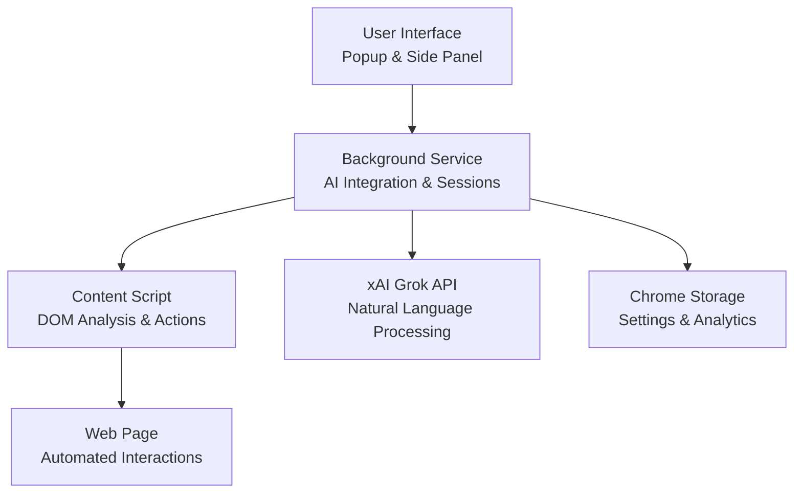

# FSB v0.1 - Full Self-Browsing

<div align="center">


[](https://github.com/lakshmanturlapati/FSB/releases)
[](LICENSE)
[](https://developer.chrome.com/docs/extensions/)
[](https://x.ai/)
[](https://github.com/lakshmanturlapati/FSB)

**An intelligent, open-source browser automation assistant powered by AI**

*Inspired by Project Mariner, built for everyone*

[Quick Start](#quick-start) | [Documentation](#documentation) | [Configuration](#configuration) | [Contributing](#contributing)

</div>

---

##  Overview

FSB (Full Self-Browsing) is a powerful Chrome extension that brings AI-powered browser automation to your fingertips. Simply describe what you want to accomplish in natural language, and FSB will analyze the webpage, plan the necessary actions, and execute them automatically.

###  Key Features

- **AI-Powered Intelligence**: Uses xAI Grok-3-mini for sophisticated task understanding and execution
- **Natural Language Interface**: Describe tasks in plain English - no complex scripting required
- **Smart DOM Analysis**: Advanced webpage structure analysis and element identification
- **Comprehensive Automation**: Click, type, scroll, navigate, form filling, and more
- **CAPTCHA Integration**: Built-in support for CAPTCHA solving services
- **Analytics & Monitoring**: Usage tracking, cost calculation, and performance insights
- **Modern Interface**: Clean chat-based UI with side panel support
- **Secure Configuration**: Encrypted API key storage and secure settings management
- **Smart Recovery**: Automatic stuck detection and adaptive behavior
- **Multiple UI Modes**: Popup and persistent side panel interfaces

###  Use Cases

- **Web Testing**: Automate repetitive testing workflows
- **Data Entry**: Fill forms and submit information across multiple sites
- **Research**: Navigate and extract information from websites
- **Social Media**: Automate posting and interaction tasks
- **E-commerce**: Product research and comparison shopping
- **Productivity**: Streamline routine browsing tasks

---

##  Quick Start

### Prerequisites

- Google Chrome (version 88+)
- xAI API key ([Get one here](https://x.ai/api))

### Installation

1. **Clone the repository**
   ```bash
   git clone https://github.com/lakshmanturlapati/FSB.git
   cd FSB
   ```

2. **Load the extension in Chrome**
   - Open `chrome://extensions/`
   - Enable "Developer mode" (top right)
   - Click "Load unpacked"
   - Select the FSB directory

5. **Start automating!**
   - Click the FSB extension icon
   - Enter a task like "Search for cats on Google"
   - Watch FSB work its magic

### First Steps

1. **Configure your API key**: Click the settings button and enter your xAI API key
2. **Test the connection**: Use the "Test API" button to verify everything works
3. **Try a simple task**: Start with something basic like "scroll down" or "click the search button"
4. **Explore features**: Try the side panel mode for persistent access

---

##  Documentation

### Architecture Overview

FSB follows a modular architecture designed for reliability and extensibility:



**Architecture Components:**

**User Interface Layer:**
- **Popup Chat Interface**: Quick task execution with compact chat UI
- **Side Panel Interface**: Persistent automation sessions that stay visible while browsing
- **Options/Settings Page**: Comprehensive configuration management and analytics dashboard

**Background Service Worker:**
- **Session Management**: Orchestrates automation workflows and maintains state
- **AI Integration**: Communicates with xAI Grok-3-mini for intelligent task processing
- **Configuration Manager**: Handles secure settings storage with encryption support
- **Analytics Tracking**: Monitors usage, performance, and cost calculations

**Content Script Layer:**
- **DOM Analysis**: Advanced webpage structure parsing and element identification
- **Action Execution**: Performs browser actions (click, type, scroll, navigate)
- **Logging System**: Detailed action logging for debugging and monitoring

**External Services:**
- **xAI Grok-3-mini API**: Natural language processing and task understanding
- **CAPTCHA Services**: Optional integration for automated CAPTCHA solving

### Core Components

- **`background.js`**: Orchestrates automation sessions and manages AI communication
- **`content.js`**: Executes actions on web pages and analyzes DOM structure
- **`ai-integration.js`**: Handles xAI API communication with advanced prompt engineering
- **`config.js`**: Manages settings and configuration with encryption support
- **UI Components**: Modern chat interfaces for user interaction

### Task Flow

1. **Input**: User describes task in natural language
2. **Analysis**: FSB analyzes current webpage structure
3. **Planning**: AI generates step-by-step action plan
4. **Execution**: Actions are executed with smart delays and error handling
5. **Iteration**: Process repeats until task completion or timeout
6. **Feedback**: User receives real-time updates and final results

---

##  Configuration

### Basic Setup

Access settings through the extension popup or options page:

- **API Key**: Your xAI Grok-3-mini API key
- **Speed Mode**: Choose between 'normal' and 'fast' processing
- **Action Delay**: Customize timing between actions (500-5000ms)
- **Max Iterations**: Set automation loop limits (5-50)
- **Debug Mode**: Enable detailed logging for troubleshooting

### Advanced Configuration

#### Extension Options Page
Configure all settings through the extension's built-in options page:

1. **Right-click the extension icon** → "Options"
2. **Or visit**: `chrome-extension://[extension-id]/options.html`

**Available Settings:**
- **API Configuration**: xAI and Gemini API keys with secure storage
- **Model Selection**: Choose between different AI models
- **CAPTCHA Integration**: Configure CAPTCHA solving services
- **Automation Tuning**: Action delays, max iterations, debug mode
- **Analytics Dashboard**: Monitor usage, costs, and performance

#### Security Features
- **Encrypted Storage**: API keys are automatically encrypted in Chrome storage
- **Secure Configuration**: No plain-text files or environment variables needed
- **Session Management**: Automatic cleanup and secure key handling

#### Development Setup
Create `config/dev-settings.json` for development:
```json
{
  "apiKey": "your-dev-api-key",
  "debugMode": true,
  "speedMode": "fast",
  "actionDelay": 500
}
```

---

##  Development

### Project Structure

```
FSB/
├── Assets/                 # Images and icons
├── background.js          # Background service worker
├── content.js            # Content script for DOM interaction
├── ai-integration.js     # xAI API integration
├── config.js            # Configuration management
├── popup.html/js/css    # Popup interface
├── sidepanel.html/js/css # Side panel interface
├── options.html/js/css  # Settings page
├── manifest.json        # Extension manifest
├── package.json         # Node.js configuration
├── setup.js            # Setup and initialization script
├── SETUP.md           # Detailed setup instructions
└── CLAUDE.md         # Development notes and architecture
```

### Building and Testing

```bash
# Install dependencies
npm install

# Run setup
node setup.js

# Load in Chrome for testing
# (Use chrome://extensions/ in developer mode)

# Debug console logs
# Check background script console in chrome://extensions/
```

### Contributing Guidelines

1. **Fork the repository** and create a feature branch
2. **Follow the existing code style** and patterns
3. **Add tests** for new functionality where applicable
4. **Update documentation** for any API changes
5. **Test thoroughly** across different websites and scenarios
6. **Submit a pull request** with clear description of changes

### Debugging

Enable debug mode for detailed logging:
- Set `DEBUG_MODE=true` in settings
- Check browser console for detailed action logs
- Use Chrome DevTools to inspect extension behavior
- View logs in the options page for historical data

---

##  AI Integration

FSB uses xAI's Grok-3-mini model for intelligent task processing:

### Prompt Engineering
- **System prompts** provide context about available browser actions
- **Task analysis** breaks down complex requests into actionable steps
- **Context awareness** maintains state across multiple iterations
- **Error recovery** adapts when actions fail or pages change

### Supported Actions
- **Navigation**: `navigate`, `refresh`, `goBack`, `goForward`
- **Interaction**: `click`, `type`, `hover`, `scroll`
- **Forms**: `selectOption`, `toggleCheckbox`, `clearInput`
- **Information**: `getText`, `getAttribute`, `waitForElement`
- **Special**: `solveCaptcha`, `searchGoogle`

---

##  Analytics & Monitoring

### Usage Tracking
- **Token consumption** monitoring and cost calculation
- **Success/failure rates** for different task types
- **Performance metrics** including execution time
- **Error analysis** for debugging and improvement

### Dashboard Features
- Real-time automation status
- Historical usage charts
- Cost breakdown by model and time period
- Detailed logs with filtering options

---

##  Security & Privacy

### Data Handling
- **No personal data** is sent to external services except as required for task execution
- **API keys are encrypted** when stored locally
- **Session data** is cleared after automation completion
- **Optional logging** can be disabled for sensitive operations

### Best Practices
- Use separate API keys for development and production
- Enable encrypted storage for production use
- Regularly rotate API keys
- Review logs for any unintended actions
- Test on non-sensitive websites first

---

##  Roadmap

### Phase 1: Foundation (Current - v0.1)
- Core automation engine
- xAI Grok-3-mini integration
- Modern UI with chat interface
- Basic analytics and logging

### Phase 2: Enhanced Capabilities (v0.2)
- Advanced CAPTCHA solving integration
- Multi-tab automation support
- Custom action scripting
- Workflow templates and saving

### Phase 3: Intelligence & Scale (v0.3)
- Visual element recognition
- Cross-site automation flows
- Advanced error recovery
- Performance optimizations

### Phase 4: Ecosystem (v0.4)
- Plugin architecture
- Community action library
- Enterprise features
- Chrome Web Store publication

---

##  Acknowledgments

FSB is inspired by **Project Mariner** from Google DeepMind, but designed as an open-source alternative accessible to everyone. Special thanks to:

- The xAI team for providing powerful and accessible AI models
- The Chrome Extensions community for excellent documentation and examples
- Project Mariner for demonstrating the potential of AI-powered browsing
- All contributors and testers who help improve FSB

---

##  License

This project is licensed under the MIT License - see the [LICENSE](LICENSE) file for details.

---

##  Contributing

We welcome contributions! Whether you're fixing bugs, adding features, improving documentation, or sharing feedback, your help makes FSB better for everyone.

### Ways to Contribute

- **Bug Reports**: Found an issue? Let us know!
- **Feature Requests**: Have an idea? We'd love to hear it!
- **Code Contributions**: Pull requests are always welcome
- **Documentation**: Help improve our guides and examples
- **Testing**: Try FSB on different websites and share your experience

### Getting Started

1. Check out our [issues page](https://github.com/lakshmanturlapati/FSB/issues) for good first contributions
2. Read our contributing guidelines (coming soon)
3. Join our community discussions
4. Submit your first pull request

---

##  Support

- **GitHub Issues**: [Report bugs or request features](https://github.com/lakshmanturlapati/FSB/issues)
- **Documentation**: Check [SETUP.md](SETUP.md) for detailed configuration help
- **Community**: Join discussions in our GitHub repository

---

<div align="center">

**Made with care by [Lakshman Turlapati](https://github.com/lakshmanturlapati)**

**Star this repository if FSB helps you automate your browsing!**

*FSB - Full Self-Browsing: Making AI-powered automation accessible to everyone*

</div>