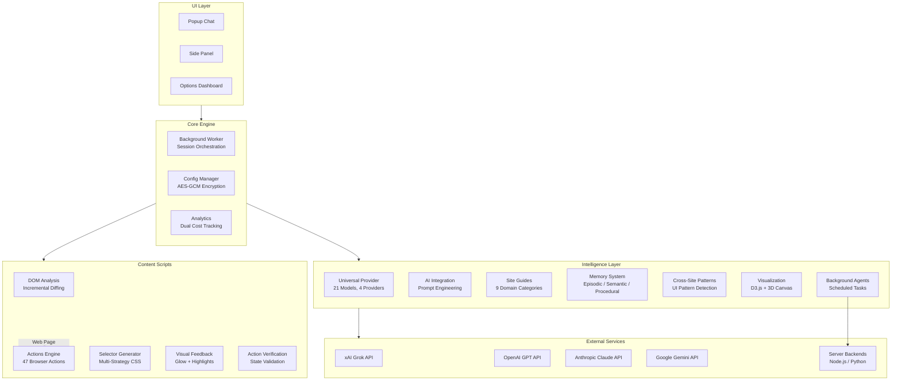
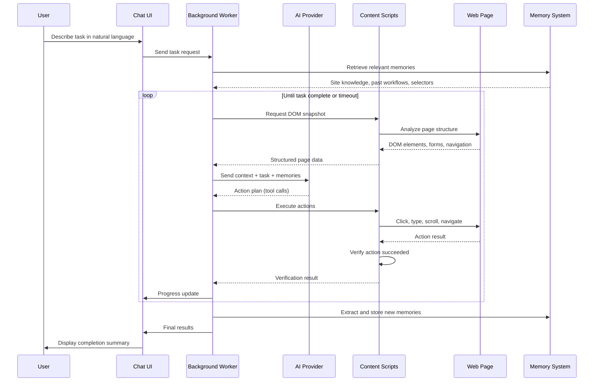

# FSB v0.9.45rc1 Full Self Browsing

<div align="center">

<picture>
  <source media="(prefers-color-scheme: dark)" srcset="assets/fsb_logo_dark.png" />
  <source media="(prefers-color-scheme: light)" srcset="assets/fsb_logo_light.png" />
  
</picture>

<!-- Row 1: Identity badges -->


<!-- Row 2: Dynamic GitHub stats -->


<!-- Row 3: Project stats + provider brands -->


**AI powered browser automation through natural language. Tell it what to do, and watch it browse for you.**

*Pure structural intelligence. Zero vision. Zero guessing.*

[Quick Start](#quick-start) · [MCP Server](#mcp-server) · [Architecture](#architecture-overview) · [AI Providers](#multi-model-ai-integration) · [Memory](#long-term-memory-system) · [Contributing](#contributing)

</div>

---

## Overview

> **Note**: FSB v0.9.45rc1 is production ready and fully functional, but browser automation can behave unpredictably on complex sites. Always monitor automation actions and test on non critical pages first. Feedback and contributions are welcome.

FSB (Full Self Browsing) is an open source Chrome extension that brings AI powered browser automation to your fingertips. Describe what you want in plain English, and FSB analyzes the page, plans the actions, and executes them. Pick from **four AI providers** (xAI Grok, OpenAI GPT, Anthropic Claude, Google Gemini) across 21 models.

### Better Than Vision Based Agents

Project Mariner, Claude Computer Use, OpenAI Operator. They all rely on vision to understand the page. **FSB reads the actual DOM.** No screenshots. No guessing.

| Metric | Vision agents | FSB |
|--------|---------------|-----|
| Per step latency | 1 to 3 seconds | 50 to 200 ms |
| Cost per 100 steps | ~$0.18 | ~$0.03 |
| Hidden elements | No | Yes |

### Use With Your Favorite AI Client

FSB ships an [MCP server](#mcp-server) so Claude Code, Cursor, Windsurf, Codex, VS Code, and any MCP capable client can drive your browser directly. The intelligence of any AI combined with the precision of FSB's DOM engine.

<details>
<summary><b>All features (detailed list)</b></summary>

- **Multi Model AI Support**: Four fully integrated providers across 21 models
- **Universal Provider Architecture**: Model agnostic engine for any OpenAI compatible API, with automatic parameter discovery and self healing
- **Natural Language Interface**: Describe tasks in plain English, no scripting
- **Smart DOM Analysis**: Webpage structure analysis with incremental diffing and element identification
- **Comprehensive Action Library**: 47 browser actions including click, type, scroll, navigate, multi tab control, and form handling
- **Site Specific Intelligence**: Domain guides for ecommerce, finance, social media, travel, coding, email, career, gaming, and productivity
- **Long Term Memory**: Episodic, semantic, and procedural memory with AI enriched extraction and consolidation across sessions
- **Background Agents**: Scheduled automation tasks with chrome.alarms, run history, and session replay
- **Site Visualization**: Per site D3.js mind maps and a consolidated 3D knowledge graph of all guide categories
- **Cross Site Pattern Analysis**: AI powered detection of recurring UI patterns across websites
- **Dual Cost Tracking**: Separate cost monitoring for automation sessions and memory operations
- **Visual Feedback**: Viewport glow indicators, element highlights, and progress overlay with step counting
- **Smart DOM Waiting**: Event driven waiting based on DOM mutations and loading state, not fixed delays
- **Markdown and Diagram Rendering**: Rich chat output with mermaid diagrams and Chart.js charts
- **Action Verification**: Post action state validation to confirm actions had their intended effect
- **Multi Tab Support**: Open, close, switch, and list browser tabs during automation
- **Dark Theme**: Full dark mode across popup, side panel, and options
- **Analytics and Monitoring**: Usage tracking, token counting, and cost calculation per model
- **CAPTCHA Integration**: Built in framework for CAPTCHA solving services
- **Secure Configuration**: AES-GCM encrypted API key storage
- **Smart Recovery**: Automatic stuck detection with DOM hashing and adaptive behavior
- **Multiple UI Modes**: Popup chat and persistent side panel

</details>

### Use Cases

- **Web Testing**: Automate repetitive QA workflows
- **Data Entry**: Fill forms across multiple sites
- **Research**: Navigate and extract information from pages
- **Ecommerce**: Product research and comparison shopping
- **Finance**: Stock lookups, portfolio monitoring, financial data gathering
- **Development**: GitHub workflows, code review navigation, coding platforms
- **Productivity**: Streamline routine browsing tasks
- **Background Monitoring**: Schedule recurring agents to track prices or changes

> **Tip**: Start with simple tasks to build familiarity, and watch what FSB does. Your feedback helps improve accuracy.

---

## Repository Layout

This repository is organized into three top level packages, each with its own README:

| Package | Purpose |
|---------|---------|
| [`extension/`](./extension/README.md) | Chrome extension (Manifest V3). The AI agent that drives the browser. Load this directory as an unpacked extension. |
| [`mcp/`](./mcp/README.md) | MCP server (npm: [`fsb-mcp-server`](https://www.npmjs.com/package/fsb-mcp-server)). Lets MCP clients (Claude Desktop, Cursor, Cline, Codex, etc.) drive the same extension. |
| [`showcase/`](./showcase/README.md) | Marketing site at [full-selfbrowsing.com](https://full-selfbrowsing.com). Angular 19 SSR + Express deploy backend. |

Top level helpers:

- `tests/` — Node test suite covering extension modules, MCP bridge contracts, and lifecycle smoke tests.
- `scripts/validate-extension.mjs` — static gate that checks `extension/manifest.json` and JS syntax across the extension tree.
- `.github/workflows/ci.yml` — runs validate, tests, MCP smoke, and showcase build on every PR.
- `Dockerfile`, `fly.toml` — production deploy of the showcase site (`showcase/server/`) on fly.io.

Run the full local CI gate from the root:

```bash
npm install
npm run validate:extension
npm test
npm run test:mcp-smoke
npm --prefix showcase/angular run build
```

---

## Screenshots

### FSB in Action

<table>
<tr>
<td width="50%" align="center">

<br/><sub><b>Task Input</b></sub>
</td>
<td width="50%" align="center">

<br/><sub><b>Task Execution</b></sub>
</td>
</tr>
</table>

<details>
<summary><strong>View more screenshots</strong></summary>

#### Dashboard and Analytics


#### API Configuration


#### Passwords Manager


#### Memory and Site Explorer


#### Intelligence Knowledge Graph


</details>

---

## Quick Start

> Get running in under two minutes. Clone, load in Chrome, configure one API key, and start automating.

### Prerequisites

- Google Chrome 88+ or any Chromium based browser (Edge, Brave, etc.)
- **One API key** from any supported provider (only one is required):
  - xAI Grok ([Get one here](https://x.ai/api)), recommended for automation
  - OpenAI ([Get one here](https://platform.openai.com/api-keys))
  - Anthropic ([Get one here](https://console.anthropic.com/))
  - Google Gemini ([Get one here](https://ai.google.dev/)), includes a FREE tier (Gemini 2.0 Flash)

### Installation

1. **Clone the repository**
   ```bash
   git clone https://github.com/lakshmanturlapati/FSB.git
   cd FSB
   ```

2. **Load the extension in Chrome**
   - Open `chrome://extensions/`
   - Enable "Developer mode" (top right)
   - Click "Load unpacked"
   - Select the FSB directory

3. **Start automating**
   - Click the FSB extension icon
   - Configure your preferred AI model and API key in settings
   - Enter a task like "Search for cats on Google"
   - Watch FSB work

### First Steps

1. **Configure your AI model**: Open settings and pick Grok, GPT, Claude, or Gemini
2. **Test the connection**: Use the "Test API" button to verify the chosen model works
3. **Start simple**: Try basic tasks like "scroll down" or "click the search button"
4. **Monitor actions**: Visual feedback shows each step
5. **Explore features**: Try side panel mode for persistent access while browsing
6. **Share feedback**: Report issues or ideas to help improve FSB

---

## MCP Server

FSB ships a standalone MCP server ([`fsb-mcp-server`](https://www.npmjs.com/package/fsb-mcp-server)) that connects any MCP capable AI client to your browser. **62 tools** across manual control, visual sessions, autopilot, vault, agents, and observability.

> **Full setup, tool reference, transport options, and architecture live in [mcp/README.md](mcp/README.md).**

### One Command Install

```bash
npx -y fsb-mcp-server install --claude-desktop   # Claude Desktop
npx -y fsb-mcp-server install --claude-code      # Claude Code
npx -y fsb-mcp-server install --cursor           # Cursor
npx -y fsb-mcp-server install --vscode           # VS Code
npx -y fsb-mcp-server install --windsurf         # Windsurf
npx -y fsb-mcp-server install --cline            # Cline
npx -y fsb-mcp-server install --zed              # Zed
npx -y fsb-mcp-server install --gemini           # Gemini CLI
npx -y fsb-mcp-server install --codex            # OpenAI Codex
npx -y fsb-mcp-server install --continue         # Continue
npx -y fsb-mcp-server install --all              # All detected platforms
```

Preview without writing: `npx -y fsb-mcp-server install --all --dry-run`
Remove from a platform: `npx -y fsb-mcp-server uninstall --cursor`

### Manual Setup Examples

**Claude Code**
```bash
claude mcp add --scope user fsb -- npx -y fsb-mcp-server
```

**Codex** (`~/.codex/config.toml`)
```toml
[mcp_servers.fsb]
command = "npx"
args = ["-y", "fsb-mcp-server"]
```

**VS Code / Cursor / Windsurf** (`mcp.json` or equivalent)
```json
{
  "mcpServers": {
    "fsb": { "command": "npx", "args": ["-y", "fsb-mcp-server"] }
  }
}
```

For OpenCode, OpenClaw, parity notes, visual session lifecycle, transport options (stdio or local Streamable HTTP), and the full 62 tool reference, see [mcp/README.md](mcp/README.md).

If MCP stops working, run `npm run test:mcp-smoke` first, then `npx -y fsb-mcp-server doctor`, then `npx -y fsb-mcp-server status --watch`. Only fall back to manual reinstall when the reported layer points there.

---

## Documentation

### Architecture Overview

FSB follows a modular architecture designed for reliability and extensibility:


```mermaid
graph TB
    subgraph UI["UI Layer"]
        P["Popup Chat"]
        SP["Side Panel"]
        OPT["Options Dashboard"]
    end

    subgraph Core["Core Engine"]
        BG["Background Worker<br/>Session Orchestration"]
        CFG["Config Manager<br/>AES-GCM Encryption"]
        AN["Analytics<br/>Dual Cost Tracking"]
    end

    subgraph Intelligence["Intelligence Layer"]
        UP["Universal Provider<br/>21 Models, 4 Providers"]
        AI["AI Integration<br/>Prompt Engineering"]
        SG["Site Guides<br/>9 Domain Categories"]
        MEM["Memory System<br/>Episodic / Semantic / Procedural"]
        XP["Cross-Site Patterns<br/>UI Pattern Detection"]
        VIZ["Visualization<br/>D3.js + 3D Canvas"]
        AGT["Background Agents<br/>Scheduled Tasks"]
    end

    subgraph Content["Content Scripts"]
        DOM["DOM Analysis<br/>Incremental Diffing"]
        ACT["Actions Engine<br/>47 Browser Actions"]
        SEL["Selector Generator<br/>Multi-Strategy CSS"]
        VF["Visual Feedback<br/>Glow + Highlights"]
        AV["Action Verification<br/>State Validation"]
    end

    subgraph External["External Services"]
        XAI["xAI Grok API"]
        OAI["OpenAI GPT API"]
        ANT["Anthropic Claude API"]
        GEM["Google Gemini API"]
        SRV["Server Backends<br/>Node.js / Python"]
    end

    UI --> Core
    Core --> Intelligence
    Core --> Content
    Intelligence --> External
    AGT --> SRV
    Content --> |"Web Page<br/>Automated Interactions"| ACT

```

**Architecture Components:**

**User Interface Layer**
- **Popup Chat**: Quick task execution with compact chat UI and markdown rendering
- **Side Panel**: Persistent automation sessions visible while browsing
- **Options Dashboard**: Configuration, analytics, memory viewer, session history, and log viewer

**Background Service Worker**
- **Session Management**: Orchestrates automation workflows and maintains state
- **Universal Provider**: Model agnostic AI communication with automatic parameter discovery
- **Configuration Manager**: AES-GCM encrypted settings storage
- **Analytics Tracking**: Usage, performance, and cost calculations per model
- **Site Guide Loader**: Matches the current domain to specialized guides across 9 categories

**Content Script Layer (10 modular files)**
- **DOM Analysis** (`dom-analysis.js`, `dom-state.js`): Page structure parsing with incremental diffing
- **Action Execution** (`actions.js`): 47 browser actions with smart delays and error handling
- **Selector Generation** (`selectors.js`): Multiple CSS selector strategies for reliability
- **Action Verification** (`utils/action-verification.js`): Post action state validation
- **Visual Feedback** (`visual-feedback.js`): Viewport glow, element highlights, and progress overlay
- **Accessibility, Messaging, Lifecycle**: ARIA helpers, background communication, init/cleanup guards

**Memory and Intelligence Layer**
- **Memory Manager** (`lib/memory/memory-manager.js`): Lifecycle orchestration for creation, retrieval, consolidation, and cleanup
- **Memory Extractor** (`lib/memory/memory-extractor.js`): AI enriched extraction of episodic, semantic, and procedural memories
- **Memory Consolidator** (`lib/memory/memory-consolidator.js`): Deduplication and merging over time
- **Cross Site Patterns** (`lib/memory/cross-site-patterns.js`): Detects recurring login flows, navigation, and form layouts across sites
- **Site Visualization** (`lib/visualization/site-graph.js`): D3.js force directed per site mind maps
- **Knowledge Graph** (`lib/visualization/knowledge-graph.js`): 3D Canvas consolidated view of all 9 site guide categories
- **Sitemap Processing** (`sitemap-converter.js`, `sitemap-refiner.js`): Sitemaps to structured memory entries

**Background Agent Layer**
- **Agent Manager** (`agents/agent-manager.js`): Lifecycle for scheduled agents
- **Agent Scheduler** (`agents/agent-scheduler.js`): chrome.alarms based scheduling
- **Agent Executor** (`agents/agent-executor.js`): Runs tasks with session replay and result capture
- **Server Sync** (`agents/server-sync.js`): Optional sync with Node.js or Python backends

**External Services**
- **AI APIs**: xAI Grok, OpenAI GPT, Anthropic Claude, Google Gemini
- **CAPTCHA Services**: Optional integration for automated solving
- **Server Backends**: Optional Node.js (`showcase/server/`) and Python/Flask (`server-py/`) for agent persistence

### Core Components

<details>
<summary><b>View core component file map</b></summary>

| Path | Description |
|------|-------------|
| `background.js` | Service worker, session orchestration, AI communication |
| `ai/ai-integration.js` | Prompt engineering, task type detection, response parsing |
| `ai/universal-provider.js` | Model agnostic AI provider with automatic parameter discovery |
| `ai/ai-providers.js` | Provider configurations and model registry |
| `config/config.js` | Configuration management with model validation |
| `config/secure-config.js` | AES-GCM encrypted API key storage |
| `config/init-config.js` | First run setup and configuration migration |
| `content/` | 10 modular content script files |
| `content/actions.js` | 47 browser action tools |
| `content/dom-analysis.js` | DOM traversal and element extraction |
| `content/visual-feedback.js` | Viewport glow, element highlights, progress overlay |
| `lib/memory/` | Long term memory system (9 modules) |
| `lib/visualization/site-graph.js` | D3.js force directed per site visualization |
| `lib/visualization/knowledge-graph.js` | 3D Canvas consolidated knowledge graph |
| `agents/` | Background agent system (4 modules) |
| `utils/analytics.js` | Usage tracking, token counting, cost calculation |
| `utils/automation-logger.js` | Structured logging with session recording |
| `utils/action-verification.js` | Post action state validation |
| `utils/dom-state-manager.js` | Incremental DOM diffing |
| `utils/keyboard-emulator.js` | Chrome DevTools Protocol key emulation |
| `utils/site-explorer.js` | Automated website reconnaissance via BFS crawling |
| `site-guides/` | Domain specific automation intelligence (9 categories) |
| `site-maps/` | Generated site structure maps (JSON) |
| `ui/` | Popup, side panel, options, markdown renderer |
| `showcase/server/` | Optional Node.js backend for agent data |
| `server-py/` | Optional Python/Flask backend for agent data |

</details>

### Task Flow

1. **Input**: User describes a task in natural language
2. **Analysis**: FSB reads the current page (DOM elements, forms, navigation)
3. **Memory Retrieval**: Relevant memories (site knowledge, past workflows, selectors) load for context
4. **Planning**: AI generates a step by step action plan from page context, site guides, and memories
5. **Execution**: Actions run with smart delays, visual feedback, and error handling
6. **Verification**: Post action state validation confirms the intended effect
7. **Iteration**: Repeats until task completion, stuck detection triggers recovery, or timeout
8. **Memory Extraction**: Episodic, semantic, and procedural memories are extracted and AI enriched
9. **Feedback**: User receives real time updates and final results in the chat

### Automation Lifecycle


```mermaid
sequenceDiagram
    participant U as User
    participant UI as Chat UI
    participant BG as Background Worker
    participant AI as AI Provider
    participant CS as Content Scripts
    participant WP as Web Page
    participant MEM as Memory System

    U->>UI: Describe task in natural language
    UI->>BG: Send task request
    BG->>MEM: Retrieve relevant memories
    MEM-->>BG: Site knowledge, past workflows, selectors

    loop Until task complete or timeout
        BG->>CS: Request DOM snapshot
        CS->>WP: Analyze page structure
        WP-->>CS: DOM elements, forms, navigation
        CS-->>BG: Structured page data

        BG->>AI: Send context + task + memories
        AI-->>BG: Action plan (tool calls)

        BG->>CS: Execute actions
        CS->>WP: Click, type, scroll, navigate
        WP-->>CS: Action result

        CS->>CS: Verify action succeeded
        CS-->>BG: Verification result
        BG->>UI: Progress update
    end

    BG->>MEM: Extract and store new memories
    BG->>UI: Final results
    UI->>U: Display completion summary
```

---

## Configuration

### Basic Setup

Open settings through the extension popup or options page:

- **AI Provider and Model**: Pick provider and model (see table below)
- **API Keys**: Configure keys for your provider(s)
- **Action Delay**: Customize timing between actions (500 to 5000 ms)
- **Max Iterations**: Set automation loop limits (5 to 50)
- **Debug Mode**: Enable detailed logging
- **DOM Optimization**: Configure element limits and viewport prioritization

### Supported Models

<details>
<summary><b>View all 21 models with pricing</b></summary>

#### xAI Grok
| Model | Description | Cost (per 1M tokens) |
|-------|-------------|---------------------|
| **grok-4-1-fast** | High speed with reasoning, 2M context (Recommended) | $0.20 / $0.50 |
| grok-4-1-fast-non-reasoning | Faster responses, no reasoning | $0.20 / $0.50 |
| grok-4 | Complex reasoning model | $3.00 / $15.00 |
| grok-code-fast-1 | Dedicated code generation and debugging | $0.20 / $1.50 |
| grok-3 | Legacy flagship model | $5.00 / $25.00 |
| grok-3-mini | Budget option with reasoning | $0.30 / $1.50 |

#### OpenAI GPT
| Model | Description | Cost (per 1M tokens) |
|-------|-------------|---------------------|
| **gpt-4o** | Most capable multimodal model | $5.00 / $20.00 |
| chatgpt-4o-latest | Always newest GPT-4o version | $5.00 / $20.00 |
| gpt-4o-mini | Affordable and fast | $0.15 / $0.60 |
| gpt-4-turbo | Previous generation flagship | $10.00 / $30.00 |

#### Anthropic Claude
| Model | Description | Cost (per 1M tokens) |
|-------|-------------|---------------------|
| **claude-sonnet-4-5** | Latest flagship with 200K context | $3.00 / $15.00 |
| claude-haiku-4-5 | Fast and cost effective, 200K context | $1.00 / $5.00 |
| claude-opus-4-1 | Most powerful reasoning model | $15.00 / $75.00 |
| claude-sonnet-4 | Previous Sonnet | $3.00 / $15.00 |
| claude-opus-4 | Previous Opus | $15.00 / $75.00 |
| claude-sonnet-3.7 | Extended thinking variant | $3.00 / $15.00 |

#### Google Gemini
| Model | Description | Cost (per 1M tokens) |
|-------|-------------|---------------------|
| **gemini-2.5-flash** | Latest with thinking capabilities | $0.30 / $2.50 |
| gemini-2.5-flash-lite | Budget option with 1M context | $0.10 / $0.40 |
| gemini-2.5-pro | Most powerful with 2M context | $1.25 / $10.00 |
| gemini-2.0-flash | Fast and efficient (FREE) | $0.00 / $0.00 |
| gemini-2.0-flash-exp | Free experimental | $0.00 / $0.00 |

</details>

#### Cost Tiers

- **Free**: Gemini 2.0 Flash (experimental)
- **Budget**: grok-4-1-fast ($0.20/$0.50) or GPT-4o Mini ($0.15/$0.60)
- **Balanced**: Gemini 2.5 Flash ($0.30/$2.50) or Claude Haiku 4.5 ($1.00/$5.00)
- **Performance**: GPT-4o ($5.00/$20.00) or Claude Sonnet 4.5 ($3.00/$15.00)
- **Maximum**: Claude Opus 4.1 ($15.00/$75.00) or Gemini 2.5 Pro ($1.25/$10.00)

### Advanced Configuration

#### Extension Options Page
1. **Right click the extension icon**, then select "Options"
2. **Or visit**: `chrome-extension://[extension-id]/options.html`

#### Security Features
- **Encrypted Storage**: API keys are AES-GCM encrypted in Chrome storage
- **Secure Configuration**: No plain text files or environment variables
- **Session Management**: Automatic cleanup and secure key handling
- **XSS Protection**: DOMPurify sanitization for all rendered chat content
- **Tab Security**: Automation is restricted to the active session tab

---

## Development

### Project Structure

<details>
<summary><b>View full project structure</b></summary>

```
FSB/
  agents/                       # Background automation agents
    agent-executor.js
    agent-manager.js
    agent-scheduler.js
    server-sync.js
  ai/                           # AI integration layer
    ai-integration.js
    ai-providers.js
    universal-provider.js
  assets/                       # Icons and images
  config/                       # Configuration management
    config.js
    init-config.js
    secure-config.js
  content/                      # Content script modules (10 files)
    accessibility.js
    actions.js
    dom-analysis.js
    dom-state.js
    init.js
    lifecycle.js
    messaging.js
    selectors.js
    utils.js
    visual-feedback.js
  lib/                          # Libraries and subsystems
    memory/                     # Long term memory (9 modules)
      cross-site-patterns.js
      memory-consolidator.js
      memory-extractor.js
      memory-manager.js
      memory-retriever.js
      memory-schemas.js
      memory-storage.js
      sitemap-converter.js
      sitemap-refiner.js
    visualization/
      site-graph.js
      knowledge-graph.js
      d3-*.min.js
    chart.min.js
    marked.min.js
    mermaid.min.js
    purify.min.js
  Logs/                         # Session logs (runtime)
  mcp/                          # MCP server package (62 tools)
  showcase/server/              # Optional Node.js backend (deploy target)
  server-py/                    # Optional Python/Flask backend
  showcase/                     # Marketing website (Angular)
  site-guides/                  # Domain specific AI guides (9 categories)
  site-maps/                    # Generated site structure maps
  ui/                           # popup, sidepanel, options, unlock
  utils/                        # action-verification, analytics, logger, etc.
  background.js                 # Service worker
  manifest.json                 # Manifest V3
  package.json                  # Project metadata
```

</details>

### Building and Testing

```bash
git clone https://github.com/lakshmanturlapati/FSB.git
cd FSB
# Open chrome://extensions/ in developer mode
# Click "Load unpacked" and select the FSB directory
```

No build step or npm install is required. FSB runs directly as a Chrome extension.

### Debugging

- Enable **Debug Mode** in the options page for detailed logging
- Inspect the **background script console** via `chrome://extensions/` (click "Inspect views: service worker")
- Use the **log viewer** in the options page to review session history
- Check the **browser console** on any page for content script logs

### Contributing Guidelines

1. **Fork the repository** and create a feature branch
2. **Follow the existing code style** and patterns
3. **Test thoroughly** across different websites
4. **Update documentation** for any API changes
5. **Submit a pull request** with a clear description

---

## Multi Model AI Integration

<div align="center">


</div>

FSB supports four AI providers through a universal, model agnostic architecture. Each has unique strengths.

### Supported AI Providers

#### xAI Grok
- **Strengths**: Fast responses, creative problem solving, handles complex web interactions
- **Best for**: Dynamic websites, real time automation, unconventional UI patterns
- **Recommended**: `grok-4-1-fast` (2M context, high speed, low cost)

#### OpenAI GPT
- **Strengths**: Broad knowledge, reliable structured output, strong reasoning
- **Best for**: General purpose automation, data extraction, multi step workflows
- **Recommended**: `gpt-4o` (multimodal, consistent results)

#### Anthropic Claude
- **Strengths**: Advanced reasoning, strong code understanding, careful and thorough
- **Best for**: Complex forms, code heavy sites, nuanced tasks
- **Recommended**: `claude-sonnet-4-5` (balanced performance and cost)

#### Google Gemini
- **Strengths**: Reliable structured output, analytical, FREE tier available
- **Best for**: Structured forms, data entry, systematic workflows, budget usage
- **Recommended**: `gemini-2.5-flash` (latest with thinking)

### Universal Provider Architecture

FSB's universal provider eliminates provider specific code:

- **Any OpenAI compatible API**: Works with any endpoint that follows the OpenAI chat completions format
- **Automatic parameter discovery**: Learns supported parameters by retrying on errors
- **Self healing**: Adapts when APIs change or add/remove parameters
- **Configuration caching**: Remembers successful configurations per model
- **Custom endpoints**: Add new providers by configuring an endpoint URL, no code changes

### Advanced Prompt Engineering

- **Task type detection**: Classifies tasks (search, form, extraction, navigation) for optimized prompts
- **Context aware system prompts**: Dynamic tool documentation based on task type
- **Model specific formatting**: Tailored instructions for each provider
- **Enter first strategy**: Natural form filling patterns
- **Retry with enhancement**: Progressive prompt improvement on parsing failures (3 attempts with backoff)

### Comprehensive Action Library

<details>
<summary><b>View all 47 browser actions by category</b></summary>

**Navigation**: `navigate`, `searchGoogle`, `refresh`, `goBack`, `goForward`

**Clicking**: `click`, `clickSearchResult`, `rightClick`, `doubleClick`, `hover`, `focus`, `blur`

**Text Input**: `type`, `clearInput`, `selectText`, `pressEnter`, `keyPress`, `pressKeySequence`, `typeWithKeys`, `sendSpecialKey`

**Form Controls**: `selectOption`, `toggleCheckbox`

**Information**: `getText`, `getAttribute`, `setAttribute`, `getEditorContent` (Monaco, CodeMirror, etc.)

**Scrolling**: `scroll`, `scrollToTop`, `scrollToBottom`, `scrollToElement`

**Multi Tab**: `openNewTab`, `switchToTab`, `closeTab`, `listTabs`, `getCurrentTab`, `waitForTabLoad`

**Waiting and Detection**: `waitForElement`, `waitForDOMStable`, `detectLoadingState`

**Game and Arrow Controls**: `gameControl`, `arrowUp`, `arrowDown`, `arrowLeft`, `arrowRight`

**Special**: `solveCaptcha`, `moveMouse`, `verifyMessageSent`

</details>

---

## Site Specific Intelligence

FSB ships a site guides system that gives the AI domain specific knowledge, improving accuracy and reducing token usage.

### How It Works

When you navigate to a supported domain, FSB loads the relevant guide. Each guide provides:

- **Domain specific selectors**: Pre mapped CSS selectors for common elements
- **Workflow patterns**: Step by step instructions for common tasks
- **Navigation hints**: How the site's UI is structured
- **Gotchas and workarounds**: Known quirks and how to handle them

### Supported Domains

| Category | Sites |
|----------|-------|
| **Ecommerce** | Amazon, eBay, Walmart, similar shopping sites |
| **Finance** | Yahoo Finance, TradingView, financial platforms |
| **Social Media** | Major social media platforms |
| **Travel** | Flight booking and hotel reservation sites |
| **Coding** | GitHub, LeetCode, developer platforms |
| **Email** | Gmail, Outlook, email services |
| **Career** | LinkedIn, Indeed, job platforms |
| **Gaming** | Steam, Epic, gaming platforms |
| **Productivity** | Google Workspace, Notion, productivity tools |

Site guides cut token usage by 30 to 40% by giving focused context instead of forcing the AI to analyze the full DOM.

---

## Long Term Memory System

FSB maintains a persistent memory system that learns from sessions and improves over time.

### Memory Types

- **Episodic Memory**: Records of specific sessions, what happened, what actions were taken, what succeeded or failed. Used to avoid repeating mistakes and replay successful workflows.
- **Semantic Memory**: Factual knowledge about websites, structure, navigation, important selectors, form layouts. Built up across visits to the same domain.
- **Procedural Memory**: Verified step by step workflows for login sequences, checkout flows, and data entry. Includes success rate tracking per procedure.

### How It Works

1. **Extraction**: After each session, the memory extractor analyzes the log and identifies memories worth keeping
2. **AI Enrichment**: Each memory passes through AI analysis for categorization, tagging, and quality scoring
3. **Consolidation**: The consolidator periodically merges related memories, deduplicates entries, and prunes low quality data
4. **Retrieval**: When a new task starts, the retriever loads relevant memories based on domain, task type, and context
5. **Cross Site Patterns**: Detects recurring UI patterns (login forms, navigation menus, modal dialogs) across websites and creates generalized knowledge

### Site Visualization

- **Per Site Graphs**: D3.js force directed mind maps for individual site memories
- **Knowledge Graph**: Consolidated 3D Canvas view rendering all 9 site guide categories and 43+ supported sites as a single rotating graph, with search highlighting and detail level toggles

### Cost Tracking

Memory operations that use AI (extraction, enrichment, cross site analysis) are tracked separately from automation costs. The Memory section in the options dashboard shows a dedicated cost panel.

---

## Background Agents

FSB supports scheduled background automation through its agent system.

### How Agents Work

- **Creation**: Define a task, target URL, and schedule from the options dashboard
- **Scheduling**: chrome.alarms run at specified intervals (hourly, daily, weekly, custom)
- **Execution**: When triggered, the executor opens the target page, runs the task, and captures results
- **Run History**: Every run is logged with timestamps, outcomes, and session details
- **Session Replay**: Past runs can be reviewed step by step

### Server Backends (Optional)

For persistent agent data beyond Chrome storage limits:

- **Node.js** (`showcase/server/`): Express based API server
- **Python/Flask** (`server-py/`): Alternative backend with SQLite and Fly.io deployment

Server backends are optional. Agents work fully with local Chrome storage.

---

## Visual Feedback System

FSB provides real time visual indicators during automation:

- **Viewport Glow**: Colored border indicating state. Thinking (blue pulse), acting (amber), complete (green flash), error (red)
- **Element Highlights**: Target element gets an animated glow before the action runs
- **Progress Overlay**: Step counter and progress bar showing current action and overall progress

---

## Analytics and Monitoring

### Usage Tracking
- **Token consumption** with per model cost calculation
- **Dual cost tracking**: Automation and memory operations tracked separately
- **Success/failure rates** for task and action categories
- **Performance metrics** including execution time and AI response latency
- **Error analysis** for debugging
- **30 day data retention** with automatic cleanup

### Dashboard Features
- Real time automation status
- Historical usage charts with cost breakdown by model and time period
- Overall cost summary panel in the Dashboard hero
- Dedicated memory operations cost panel in the Memory section
- Memory tab with auto refresh, detail panels, and inline controls
- Session history viewer with detailed action logs
- Settings export for backup and migration
- Detailed logs with filtering options

---

## Security and Privacy

### Data Handling
- **No personal data** is sent externally except as required for task execution
- **API keys** are AES-GCM encrypted in local storage
- **Session data** is cleared after completion
- **Optional logging** can be disabled for sensitive operations
- **XSS protection** via DOMPurify on all rendered chat content

### Best Practices
- Use separate API keys for development and production
- Enable encrypted storage for production
- Rotate API keys regularly
- Review logs for any unintended actions
- Test on non sensitive websites first

### Safety Guidelines
- **Always monitor automation** via visual feedback
- **Start with safe sites** like test pages or your own domains
- **Verify results** and double check outcomes
- **Tab isolation**: FSB controls only the active session tab
- **Report issues** to help improve FSB
- **Use responsibly**: Respect website terms of service and rate limits

---

## Roadmap

### Completed in v0.9.50
- Full automation engine with smart iteration and stuck recovery
- Four AI providers (xAI, OpenAI, Anthropic, Gemini) across 21 models
- Universal model agnostic provider architecture
- Modern chat UI with markdown, mermaid, and Chart.js
- Site specific intelligence across 9 domain categories
- Action verification and visual feedback
- Analytics dashboard with cost tracking
- Encrypted configuration and secure API key storage
- Multi tab automation
- Comprehensive logging and debugging tools

### Completed in v9.1 to v9.3
- Long term memory (episodic, semantic, procedural)
- AI enriched memory extraction
- Cross site pattern analysis
- D3.js site visualization
- Background agent system with scheduling and run history
- Content script modularization (10 focused modules)
- Memory intelligence overhaul with detail viewers and cost tracking
- Optional server backends (Node.js and Python/Flask)
- Sitemap generation and refinement
- Site guides viewer with consolidated 3D knowledge graph

### Completed in v0.9.34 to v0.9.36
- Vault management with numeric PIN unlock, credential CRUD, payment method storage
- MCP server v0.7.3 with bridge lifecycle reconnect across service worker wakes
- Centralized MCP tool routing contract
- Layered MCP diagnostics (`doctor`, `status --watch`)
- Explicit visual session lifecycle for MCP clients
- Trusted client badges (Claude, Codex, Cursor, etc.) on the automation overlay
- Visual session persistence across content script reinjection
- One command install for 10+ MCP platforms
- Secure vault bridge handlers with sensitive content redaction
- Payment confirmation timeout alignment across MCP boundary

### Future
- Advanced CAPTCHA solver integration (Buster, CapSolver, 2Captcha)
- Workflow templates and task saving
- Chrome Web Store publication
- Visual element recognition and computer vision
- Plugin architecture for custom actions
- Enterprise features, team collaboration, and compliance

---

## Acknowledgments

FSB is inspired by **Project Mariner** from Google DeepMind, designed as an open source alternative accessible to everyone. The multi model approach is made possible by:

**AI Model Providers**
- **xAI Team**: For powerful and accessible Grok models
- **OpenAI**: For the GPT family and the chat completions API standard
- **Anthropic**: For Claude models with advanced reasoning
- **Google AI**: For Gemini, including a free tier

**Community and Inspiration**
- **Project Mariner**: For demonstrating the potential of AI powered browsing
- **Chrome Extensions Community**: For excellent documentation and resources
- **Open Source Contributors**: Every bug report, feature request, and pull request
- **Beta Testers**: Community members helping test across different sites

Every contributor, tester, and community member helps push FSB forward.

---

## License

This project is licensed under the Business Source License 1.1. See the [LICENSE](LICENSE) file for details.

---

## Contributing

**FSB thrives on community contributions.** Bug fixes, features, documentation, testing on new websites, or feedback: every contribution counts.

### Priority Contribution Areas

- **Testing and Feedback**: Try FSB on different websites and report what works
- **Bug Reports**: Document issues with steps to reproduce
- **Feature Requests**: Share ideas for better automation
- **Code Contributions**: Implement features, fix bugs, optimize performance
- **Documentation**: Improve guides, add examples, create tutorials
- **AI Model Integration**: Add support for new models and providers
- **Site Guides**: Add domain specific guides for new websites

### Getting Started

1. **Start Testing**: Download FSB and try it on your favorite websites
2. **Report Your Experience**: Use the [issues page](https://github.com/lakshmanturlapati/FSB/issues)
3. **Join Discussions**: Engage with the community in GitHub discussions
4. **Pick an Issue**: Look for "good first issue" labels
5. **Submit Code**: Fork, improve, and submit pull requests

Contributors are recognized in the acknowledgments and become part of FSB's story.

---

## Support

- **GitHub Issues**: [Report bugs or request features](https://github.com/lakshmanturlapati/FSB/issues)
- **Options Page**: Built in help section and log viewer
- **Community**: GitHub discussions in this repository

---

<div align="center">

**Made with care by [Lakshman Turlapati](https://github.com/lakshmanturlapati)**

**Star this repository if FSB helps you automate your browsing.**

*FSB Full Self Browsing: AI powered automation, accessible to everyone.*

[Back to top](#fsb-v0936-full-self-browsing)

</div>
