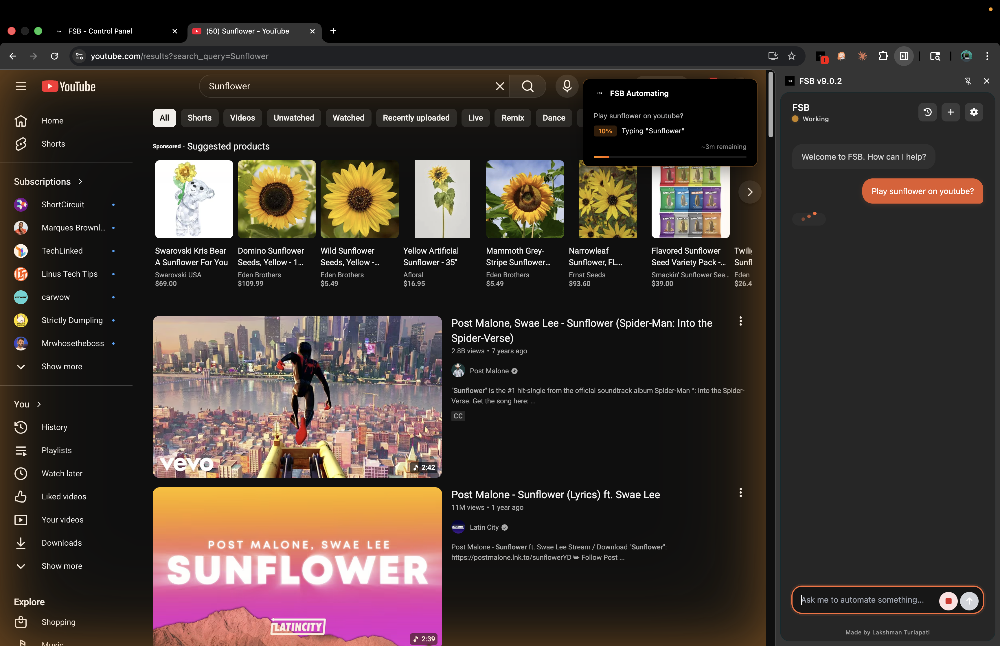
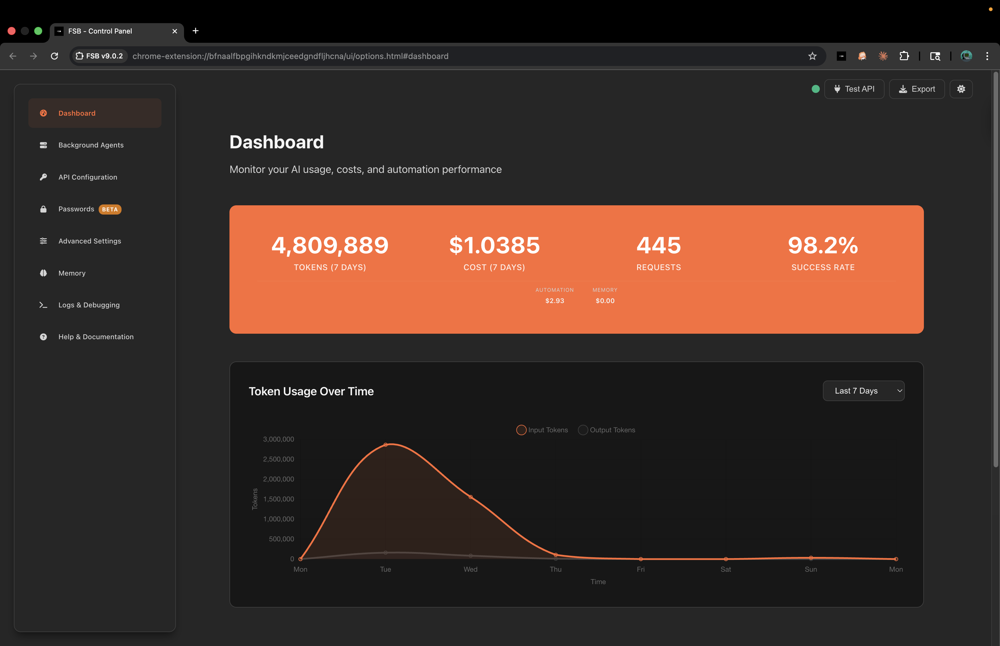
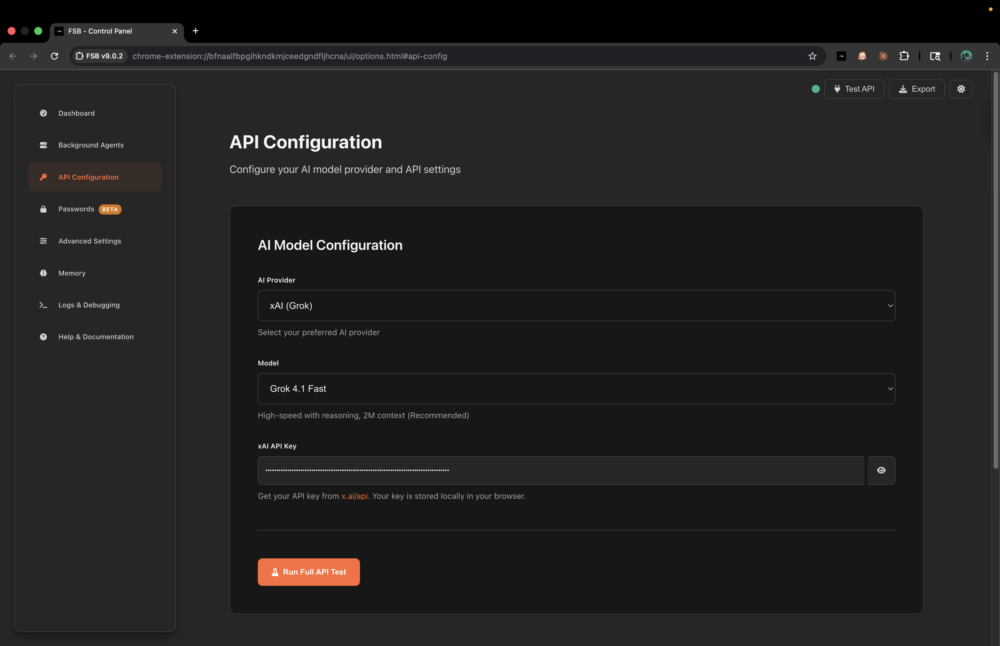
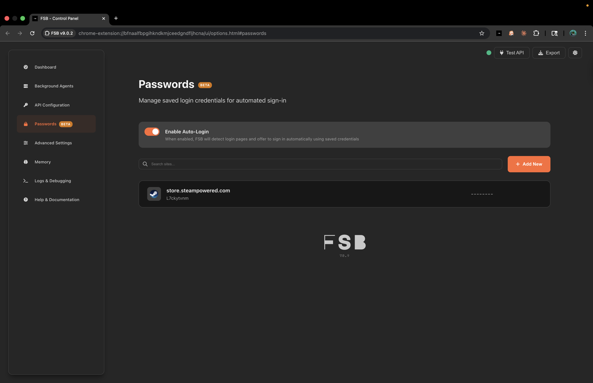
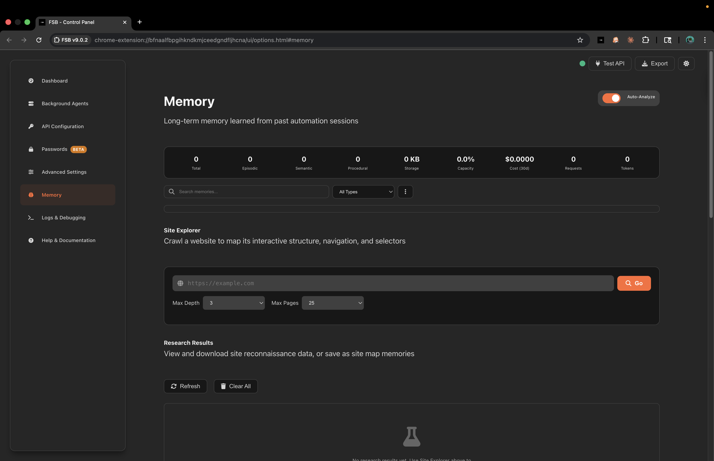
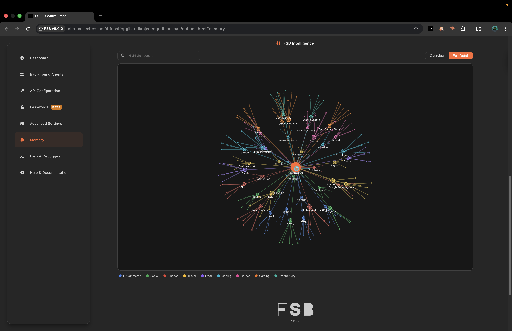
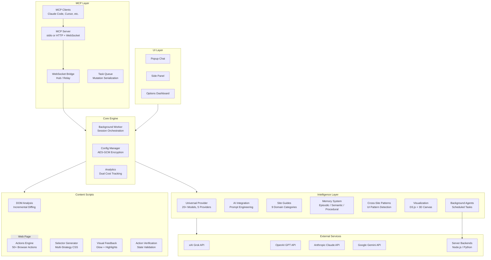
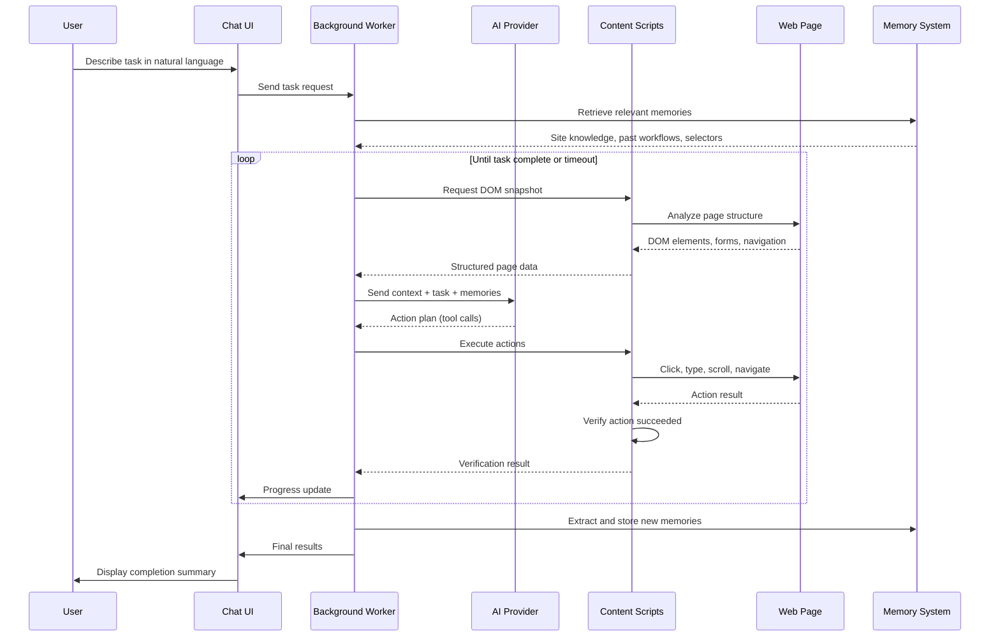

# FSB v0.9.20: Full Self-Browsing

<div align="center">

<picture>
  <source media="(prefers-color-scheme: dark)" srcset="assets/fsb_logo_dark.png" />
  <source media="(prefers-color-scheme: light)" srcset="assets/fsb_logo_light.png" />
  
</picture>

<!-- Row 1: Identity badges -->


<!-- Row 2: Dynamic GitHub stats -->


<!-- Row 3: Project stats + provider brands -->


**Perfecting browser automation with zero vision**

*Pure DOM intelligence. No screenshots. No computer vision. Just structure.*

*Inspired by Project Mariner, built for everyone*

[Quick Start](#quick-start) | [MCP Server](#mcp-server) | [Architecture](#architecture-overview) | [AI Providers](#multi-model-ai-integration) | [Memory](#long-term-memory-system) | [Contributing](#contributing)

</div>

---

## Overview

> **Note**: While FSB v0.9.20 is production-ready and fully functional, browser automation can behave unpredictably on complex sites. Always monitor automation actions and test on non-critical pages first. Feedback and contributions are welcome!

FSB (Full Self-Browsing) is a powerful Chrome extension that brings AI-powered browser automation to your fingertips. Simply describe what you want to accomplish in natural language, and FSB will analyze the webpage, plan the necessary actions, and execute them automatically. Choose from **five AI providers**: xAI Grok, OpenAI GPT, Anthropic Claude, Google Gemini, and OpenRouter (200+ models), with 20+ models built in. FSB can run as a **standalone Chrome extension** or be controlled by any MCP-compatible AI client (Claude Code, Cursor, Windsurf, and others) through its built-in **MCP server**: in manual mode for fine-grained control, or autopilot mode where FSB handles everything.

<details>
<summary><b>All features (detailed list)</b></summary>

- **Multi-Model AI Support**: Five fully integrated providers: xAI Grok, OpenAI GPT, Anthropic Claude, Google Gemini, and OpenRouter (200+ models), with 20+ models built in
- **Universal Provider Architecture**: Model-agnostic engine that works with any OpenAI-compatible API, with automatic parameter discovery and self-healing
- **Natural Language Interface**: Describe tasks in plain English, no scripting required
- **Smart DOM Analysis**: Advanced webpage structure analysis with incremental diffing and element identification
- **Comprehensive Action Library**: 50+ browser actions: click, type, scroll, navigate, multi-tab control, form handling, and more
- **Site-Specific Intelligence**: Domain-specific guides for e-commerce, finance, social media, travel, coding, email, career, gaming, and productivity platforms
- **Long-Term Memory**: Episodic, semantic, and procedural memory with AI-enriched extraction and consolidation across sessions
- **Background Agents**: Scheduled automation tasks with chrome.alarms, run history, and session replay
- **Site Visualization**: Per-site D3.js mind maps and a consolidated 3D knowledge graph of all site guide categories
- **Cross-Site Pattern Analysis**: AI-powered detection of recurring UI patterns across different websites
- **Dual Cost Tracking**: Separate cost monitoring for automation sessions and memory operations
- **Visual Feedback**: Viewport glow indicators, element-level action highlights, and progress overlay with step counting
- **Smart DOM Waiting**: Event-driven waiting based on DOM mutations and loading state detection, not fixed delays
- **Markdown and Diagram Rendering**: Rich chat output with mermaid diagrams and Chart.js charts
- **Action Verification**: Post-action state validation to confirm actions had their intended effect
- **Multi-Tab Support**: Open, close, switch, and list browser tabs during automation
- **Dark Theme**: Full dark mode across all interfaces (popup, side panel, options)
- **Analytics and Monitoring**: Usage tracking, token counting, cost calculation, and performance insights per model
- **CAPTCHA Integration**: Built-in framework for CAPTCHA solving services
- **Secure Configuration**: AES-GCM encrypted API key storage
- **Smart Recovery**: Automatic stuck detection with DOM hashing, action pattern analysis, and adaptive behavior
- **Multiple UI Modes**: Popup chat and persistent side panel interfaces
- **MCP Server**: Built-in Model Context Protocol server with 50+ tools: any MCP-compatible AI client can control FSB
- **Dual Operation Modes**: Use FSB standalone or through MCP, with manual (tool-by-tool) and autopilot (AI-driven) modes
- **WebSocket Bridge**: Hub/relay architecture for MCP-to-extension communication with automatic failover and multi-instance support
- **Remote Streaming**: Optional relay server connection for remote monitoring and control

</details>

### Use Cases

- **Web Testing**: Automate repetitive testing workflows
- **Data Entry**: Fill forms and submit information across multiple sites
- **Research**: Navigate and extract information from websites
- **Social Media**: Automate posting and interaction tasks
- **E-commerce**: Product research and comparison shopping
- **Finance**: Stock lookups, portfolio monitoring, financial data gathering
- **Development**: Coding platform automation, GitHub workflows, code review navigation
- **Productivity**: Streamline routine browsing tasks
- **Memory-Powered Automation**: Leverage learned site knowledge for faster, more reliable task execution
- **Background Monitoring**: Schedule recurring agents to check prices, track changes, or gather data

> **Tip**: Always monitor automation results and start with simple tasks to build familiarity. Your feedback helps improve accuracy!

---

## How FSB Compares

Every major browser agent today relies on **screenshots and computer vision** to understand web pages. FSB takes a fundamentally different approach: **pure DOM intelligence**. It reads the actual page structure -- elements, attributes, selectors, state -- directly. No screenshots. No vision models. No pixel guessing.

The result: faster, cheaper, more accurate, and capable of interacting with elements that vision-based agents literally cannot see.

<div align="center">


</div>

| | **FSB** | **Project Mariner** | **Claude Computer Use** | **OpenAI CUA** | **browser-use** |
|---|---|---|---|---|---|
| **Approach** | DOM analysis | Screenshot + Gemini vision | Screenshot + Claude vision | Screenshot + GPT-4o vision | Screenshot + LLM vision |
| **Vision required** | No | Yes | Yes | Yes | Yes |
| **Open source** | Yes (BSL 1.1) | No | No | No | Yes |
| **Speed (per step)** | 50-200ms | 1-3s | 1-3s | 1-3s | 1-3s |
| **Cost (per 100 steps)** | ~$0.03 | ~$0.18 | ~$0.18 | ~$0.18 | ~$0.15 |
| **Hidden elements** | Yes | No | No | No | No |
| **Multi-provider AI** | 5 providers, 20+ models | Gemini only | Claude only | GPT only | Limited |
| **MCP server** | Yes (50+ tools) | No | No | No | No |
| **Local extension** | Yes | No (cloud VM) | No (Docker) | No (cloud) | No (Playwright) |
| **Works offline** | With local models | No | No | No | No |

### The MCP Advantage: Works WITH All of Them

FSB does not just compete with these tools -- it **works alongside them**. Through its MCP server, any AI client can use FSB as its browser automation layer:

- **Claude Code / Claude Desktop** can call FSB's 50+ browser tools instead of using screenshot-based Computer Use
- **Cursor / Windsurf** can drive FSB for web testing and research without leaving the IDE
- **Any MCP-compatible agent** gets instant access to DOM-based browser automation

This means you get the intelligence of Claude, GPT, or Gemini combined with the precision of FSB's DOM engine -- the best of both worlds.

---

## Screenshots

### FSB in Action

<table>
<tr>
<td width="50%" align="center">

<br/><sub><b>Task Input</b></sub>
</td>
<td width="50%" align="center">

<br/><sub><b>Task Execution</b></sub>
</td>
</tr>
</table>

<details>
<summary><strong>View more screenshots</strong>: Options Dashboard</summary>

#### Dashboard and Analytics


#### API Configuration


#### Passwords Manager


#### Memory and Site Explorer


#### Intelligence Knowledge Graph


</details>

---

## Quick Start

> **Get running in under 2 minutes**: Clone, load in Chrome, configure one API key, and start automating.

### Prerequisites

- Google Chrome (version 88+) or any Chromium-based browser (Edge, Brave, etc.)
- **One API key** from any supported provider (only one is required):
  - xAI Grok API key ([Get one here](https://x.ai/api)): recommended for automation
  - OpenAI API key ([Get one here](https://platform.openai.com/api-keys))
  - Anthropic API key ([Get one here](https://console.anthropic.com/))
  - Google Gemini API key ([Get one here](https://ai.google.dev/)): includes a FREE tier (Gemini 2.0 Flash)

### Installation

1. **Clone the repository**
   ```bash
   git clone https://github.com/lakshmanturlapati/FSB.git
   cd FSB
   ```

2. **Load the extension in Chrome**
   - Open `chrome://extensions/`
   - Enable "Developer mode" (top right)
   - Click "Load unpacked"
   - Select the FSB directory

3. **Start automating!**
   - Click the FSB extension icon
   - Configure your preferred AI model and API key in settings
   - Enter a task like "Search for cats on Google"
   - Watch FSB work (and monitor the actions!)

### First Steps

1. **Configure your AI model**: Click settings and choose between Grok, GPT, Claude, or Gemini
2. **Test the connection**: Use the "Test API" button to verify your chosen model works
3. **Start simple**: Try basic tasks like "scroll down" or "click the search button"
4. **Monitor actions**: Watch what FSB does: visual feedback shows each step
5. **Explore features**: Try the side panel mode for persistent access during browsing
6. **Share feedback**: Report issues or suggestions to help improve FSB

---

## MCP Server

FSB includes a built-in [Model Context Protocol](https://modelcontextprotocol.io/) server that exposes the full browser automation engine to any MCP-compatible AI client. Any tool that speaks MCP: Claude Code, Cursor, Windsurf, or your own agents, can plug in and control FSB.

### Two Ways to Use FSB

| Mode | Description | Best For |
|------|-------------|----------|
| **Standalone** | Use FSB directly as a Chrome extension via the popup or side panel | Interactive browsing, quick tasks, visual monitoring |
| **MCP** | Connect an external AI client to FSB's MCP server | Agent workflows, programmatic control, CI pipelines |

### MCP Operating Modes

Within MCP, FSB offers three operating modes:

**Manual Mode**: Direct browser control through 50+ individual tools. The AI client decides what to do; FSB executes each action.

**Autopilot Mode**: Delegate an entire task to FSB. When an AI API key is configured in the extension, `run_task` hands the goal to FSB's built-in AI loop, which plans, executes, recovers from errors, and reports back with progress updates. The external client just watches.

**Agent Mode**: Create, run, inspect, and manage scheduled background agents directly from an MCP client without using the extension UI.

### MCP Tool Categories

| Category | Tools | Description |
|----------|-------|-------------|
| **Autopilot** | `run_task`, `stop_task`, `get_task_status` | Delegate full tasks to FSB's AI loop |
| **Manual** | 35+ tools (`navigate`, `click`, `type_text`, `scroll`, `insert_text`, etc.) | Individual browser actions with direct control |
| **Read-Only** | `read_page`, `get_text`, `get_dom_snapshot`, `list_tabs`, etc. | Information gathering: bypasses the mutation queue for concurrent reads |
| **Observability** | `list_sessions`, `get_session_detail`, `get_logs`, `search_memory`, `get_memory_stats` | Inspect past sessions, logs, and memory state |
| **Agents** | `create_agent`, `list_agents`, `run_agent`, `get_agent_history`, etc. | Manage and execute scheduled background agents over MCP |

### MCP Resources and Prompts

**Resources** (live data streams):
- `browser://dom/snapshot`: Current page DOM with element references
- `browser://tabs`: Open tabs with title, URL, and active status
- `fsb://site-guides`: Domain-specific automation intelligence

**Prompt Templates** (reusable workflows):
- `search-and-extract`: Navigate, search, and extract structured data
- `fill-form`: Navigate, identify fields, fill, and submit
- `monitor-page`: Watch for changes and report
- `navigate-and-read`: Go to a URL and extract specific content

### Install

Install from [npm](https://www.npmjs.com/package/fsb-mcp-server) -- no cloning or building required:

**New in `fsb-mcp-server@0.4.0`:**
- Optional local Streamable HTTP mode on `http://127.0.0.1:7226/mcp`
- Built-in install and diagnostics commands: `setup`, `status`, `doctor`, `wait-for-extension`
- No extension pairing change: the extension still uses `ws://localhost:7225`

**Claude Desktop** -- add to `claude_desktop_config.json`:
```json
{
  "mcpServers": {
    "fsb": {
      "command": "npx",
      "args": ["-y", "fsb-mcp-server"]
    }
  }
}
```

**Claude Code:**
```bash
claude mcp add fsb -- npx -y fsb-mcp-server
```

**Cursor** -- add to `.cursor/mcp.json`:
```json
{
  "mcpServers": {
    "fsb": {
      "command": "npx",
      "args": ["-y", "fsb-mcp-server"]
    }
  }
}
```

**Local Streamable HTTP** -- if your MCP host supports HTTP transports:
```bash
npx -y fsb-mcp-server serve
```

Default endpoint:
```text
http://127.0.0.1:7226/mcp
```

**Install / diagnostics helpers:**
```bash
npx -y fsb-mcp-server setup
npx -y fsb-mcp-server status
npx -y fsb-mcp-server doctor
npx -y fsb-mcp-server wait-for-extension
```

Make sure the FSB Chrome extension is loaded and active. The MCP server still connects to it locally via WebSocket on port 7225; the new HTTP endpoint on port 7226 is only for MCP clients.

### Communication Flow


```mermaid
graph LR
    MC["MCP Client<br/>(Claude Code, Cursor, etc.)"] -->|stdio or local HTTP<br/>JSON-RPC 2.0| MS["MCP Server"]
    MS -->|WebSocket<br/>port 7225| WSB["WebSocket Bridge<br/>Hub / Relay"]
    WSB --> BG["Background Worker<br/>Chrome Extension"]
    BG --> CS["Content Scripts"]
    CS --> WP["Web Page"]
```

- **MCP transport**: stdio or local Streamable HTTP between the AI client and the MCP server
- **WebSocket bridge**: Connects the MCP server to the Chrome extension on port 7225
- **Hub/relay pattern**: First MCP instance becomes the hub; additional instances connect as relays with automatic promotion on hub failure
- **Mutation serialization**: A task queue ensures one mutation at a time; read-only tools bypass the queue for concurrent access

---

## Documentation

### Architecture Overview

FSB follows a modular architecture designed for reliability and extensibility:


```mermaid
graph TB
    subgraph MCP["MCP Layer"]
        MCPC["MCP Clients<br/>Claude Code, Cursor, etc."]
        MCPS["MCP Server<br/>stdio or HTTP + WebSocket"]
        WSB["WebSocket Bridge<br/>Hub / Relay"]
        TQ["Task Queue<br/>Mutation Serialization"]
    end

    subgraph UI["UI Layer"]
        P["Popup Chat"]
        SP["Side Panel"]
        OPT["Options Dashboard"]
    end

    subgraph Core["Core Engine"]
        BG["Background Worker<br/>Session Orchestration"]
        CFG["Config Manager<br/>AES-GCM Encryption"]
        AN["Analytics<br/>Dual Cost Tracking"]
    end

    subgraph Intelligence["Intelligence Layer"]
        UP["Universal Provider<br/>20+ Models, 5 Providers"]
        AI["AI Integration<br/>Prompt Engineering"]
        SG["Site Guides<br/>9 Domain Categories"]
        MEM["Memory System<br/>Episodic / Semantic / Procedural"]
        XP["Cross-Site Patterns<br/>UI Pattern Detection"]
        VIZ["Visualization<br/>D3.js + 3D Canvas"]
        AGT["Background Agents<br/>Scheduled Tasks"]
    end

    subgraph Content["Content Scripts"]
        DOM["DOM Analysis<br/>Incremental Diffing"]
        ACT["Actions Engine<br/>50+ Browser Actions"]
        SEL["Selector Generator<br/>Multi-Strategy CSS"]
        VF["Visual Feedback<br/>Glow + Highlights"]
        AV["Action Verification<br/>State Validation"]
    end

    subgraph External["External Services"]
        XAI["xAI Grok API"]
        OAI["OpenAI GPT API"]
        ANT["Anthropic Claude API"]
        GEM["Google Gemini API"]
        SRV["Server Backends<br/>Node.js / Python"]
    end

    MCPC --> MCPS
    MCPS --> WSB
    WSB --> Core
    UI --> Core
    Core --> Intelligence
    Core --> Content
    Intelligence --> External
    AGT --> SRV
    Content --> |"Web Page<br/>Automated Interactions"| ACT

```

**Architecture Components:**

**User Interface Layer:**
- **Popup Chat Interface**: Quick task execution with compact chat UI and markdown rendering
- **Side Panel Interface**: Persistent automation sessions that stay visible while browsing
- **Options Dashboard**: Comprehensive configuration, analytics, memory viewer, session history, and log viewer

**Background Service Worker:**
- **Session Management**: Orchestrates automation workflows and maintains state
- **Universal Provider**: Model-agnostic AI communication with automatic parameter discovery across all providers
- **Configuration Manager**: Handles secure settings storage with AES-GCM encryption
- **Analytics Tracking**: Monitors usage, performance, and cost calculations per model
- **Site Guide Loader**: Matches current domain to specialized automation guides across 9 categories

**Content Script Layer (12 modular files):**
- **DOM Analysis**: Advanced webpage structure parsing with incremental diffing (`dom-analysis.js`, `dom-state.js`)
- **Action Execution**: 50+ browser actions with smart delays and error handling (`actions.js`)
- **Selector Generation**: Multiple CSS selector strategies for reliability (`selectors.js`)
- **Action Verification**: Post-action state validation to confirm intended effects (`utils/action-verification.js`)
- **Visual Feedback System**: Viewport glow, element highlights, and progress overlay (`visual-feedback.js`)
- **Accessibility**: Screen reader and ARIA support (`accessibility.js`)
- **Messaging**: Background script communication (`messaging.js`)
- **Lifecycle**: Script initialization, cleanup, and re-injection guards (`init.js`, `lifecycle.js`)

**Memory and Intelligence Layer:**
- **Memory Manager**: Orchestrates memory lifecycle: creation, retrieval, consolidation, and cleanup (`lib/memory/memory-manager.js`)
- **Memory Extractor**: AI-enriched extraction of episodic, semantic, and procedural memories from automation sessions (`lib/memory/memory-extractor.js`)
- **Memory Consolidator**: Deduplication and merging of related memories over time (`lib/memory/memory-consolidator.js`)
- **Cross-Site Patterns**: Detects recurring UI patterns (login flows, navigation structures, form layouts) across different websites (`lib/memory/cross-site-patterns.js`)
- **Site Visualization**: D3.js force-directed graph renderer for per-site mind maps (`lib/visualization/site-graph.js`)
- **Knowledge Graph**: 3D Canvas-based consolidated view of all site guide knowledge across 9 categories (`lib/visualization/knowledge-graph.js`)
- **Sitemap Processing**: Converts and refines sitemaps into structured memory entries (`lib/memory/sitemap-converter.js`, `sitemap-refiner.js`)

**Background Agent Layer:**
- **Agent Manager**: Creates, updates, and tracks background automation agents (`agents/agent-manager.js`)
- **Agent Scheduler**: chrome.alarms-based scheduling for recurring tasks (`agents/agent-scheduler.js`)
- **Agent Executor**: Runs agent tasks with session replay and result capture (`agents/agent-executor.js`)
- **Server Sync**: Optional synchronization with Node.js or Python server backends (`agents/server-sync.js`)

**MCP Layer:**
- **MCP Server**: Exposes FSB to external AI clients via stdio or local Streamable HTTP with 50+ tools across 4 categories (`mcp-server/src/`)
- **WebSocket Bridge**: Hub/relay architecture connecting the MCP server to the Chrome extension on port 7225 (`mcp-server/src/bridge.ts`)
- **Task Queue**: Serializes mutations to prevent race conditions; read-only tools bypass the queue for concurrent access (`mcp-server/src/queue.ts`)
- **Remote Streaming**: Optional relay server connection for remote monitoring and control (`ws/ws-client.js`)

**External Services:**
- **AI APIs**: xAI Grok, OpenAI GPT, Anthropic Claude, Google Gemini, OpenRouter
- **MCP Clients**: Claude Code, Cursor, Windsurf, or any MCP-compatible AI client
- **CAPTCHA Services**: Optional integration for automated CAPTCHA solving
- **Server Backends**: Optional Node.js (`server/`) and Python/Flask (`server-py/`) backends for agent data persistence

### Core Components

<details>
<summary><b>View core component file map</b></summary>

| Path | Description |
|------|-------------|
| `background.js` | Service worker: session orchestration and AI communication |
| `ai/ai-integration.js` | Prompt engineering, task type detection, and response parsing |
| `ai/universal-provider.js` | Model-agnostic AI provider with automatic parameter discovery |
| `ai/ai-providers.js` | Provider configurations and model registry |
| `config/config.js` | Configuration management with model validation |
| `config/secure-config.js` | AES-GCM encrypted API key storage |
| `config/init-config.js` | First-run setup and configuration migration |
| `content/` | 10 modular content script files (see Content Script Layer above) |
| `content/actions.js` | 50+ browser action tools |
| `content/dom-analysis.js` | DOM traversal and element extraction |
| `content/visual-feedback.js` | Viewport glow, element highlights, progress overlay |
| `lib/memory/` | Long-term memory system (9 modules) |
| `lib/memory/memory-manager.js` | Memory lifecycle orchestration |
| `lib/memory/memory-extractor.js` | AI-enriched memory extraction |
| `lib/memory/cross-site-patterns.js` | Cross-site UI pattern detection |
| `lib/visualization/site-graph.js` | D3.js force-directed per-site visualization |
| `lib/visualization/knowledge-graph.js` | 3D Canvas consolidated knowledge graph |
| `agents/` | Background agent system (4 modules) |
| `agents/agent-manager.js` | Agent lifecycle management |
| `agents/agent-scheduler.js` | chrome.alarms scheduling |
| `utils/analytics.js` | Usage tracking, token counting, and cost calculation |
| `utils/automation-logger.js` | Structured logging with session recording |
| `utils/action-verification.js` | Post-action state validation and outcome detection |
| `utils/dom-state-manager.js` | Incremental DOM diffing for change detection |
| `utils/keyboard-emulator.js` | Chrome DevTools Protocol key emulation |
| `utils/site-explorer.js` | Automated website reconnaissance via BFS crawling |
| `site-guides/` | Domain-specific automation intelligence (9 categories + index) |
| `site-maps/` | Generated site structure maps (JSON) |
| `ui/popup.html/js/css` | Popup chat interface |
| `ui/sidepanel.html/js/css` | Persistent side panel interface |
| `ui/control_panel.html/js/css` | Settings dashboard with analytics, memory viewer, and logs |
| `ui/markdown-renderer.js` | Markdown, mermaid diagram, and Chart.js rendering |
| `mcp-server/` | MCP server exposing FSB to external AI clients |
| `mcp-server/src/bridge.ts` | WebSocket hub/relay bridge for extension communication |
| `mcp-server/src/tools/` | Autopilot, manual, read-only, and observability tool sets |
| `ws/ws-client.js` | WebSocket client for optional remote relay connection |
| `server/` | Optional Node.js backend for agent data |
| `server-py/` | Optional Python/Flask backend for agent data |

</details>

### Task Flow

1. **Input**: User describes task in natural language
2. **Analysis**: FSB analyzes current webpage structure (DOM elements, forms, navigation)
3. **Memory Retrieval**: Relevant memories (site knowledge, past workflows, selectors) are loaded for context
4. **Planning**: AI generates step-by-step action plan based on page context, site guides, and memories
5. **Execution**: Actions are executed with smart delays, visual feedback, and error handling
6. **Verification**: Post-action state validation confirms actions had their intended effect
7. **Iteration**: Process repeats until task completion, stuck detection triggers recovery, or timeout
8. **Memory Extraction**: Episodic, semantic, and procedural memories are extracted and AI-enriched
9. **Feedback**: User receives real-time updates and final results in the chat interface

### Automation Lifecycle


```mermaid
sequenceDiagram
    participant U as User
    participant UI as Chat UI
    participant BG as Background Worker
    participant AI as AI Provider
    participant CS as Content Scripts
    participant WP as Web Page
    participant MEM as Memory System

    U->>UI: Describe task in natural language
    UI->>BG: Send task request
    BG->>MEM: Retrieve relevant memories
    MEM-->>BG: Site knowledge, past workflows, selectors

    loop Until task complete or timeout
        BG->>CS: Request DOM snapshot
        CS->>WP: Analyze page structure
        WP-->>CS: DOM elements, forms, navigation
        CS-->>BG: Structured page data

        BG->>AI: Send context + task + memories
        AI-->>BG: Action plan (tool calls)

        BG->>CS: Execute actions
        CS->>WP: Click, type, scroll, navigate
        WP-->>CS: Action result

        CS->>CS: Verify action succeeded
        CS-->>BG: Verification result
        BG->>UI: Progress update
    end

    BG->>MEM: Extract and store new memories
    BG->>UI: Final results
    UI->>U: Display completion summary
```

---

## Configuration

### Basic Setup

Access settings through the extension popup or options page:

- **AI Provider and Model**: Choose your provider and model (see table below)
- **API Keys**: Configure keys for your chosen AI provider(s)
- **Action Delay**: Customize timing between actions (500-5000ms)
- **Max Iterations**: Set automation loop limits (5-50)
- **Debug Mode**: Enable detailed logging for troubleshooting
- **DOM Optimization**: Configure element limits and viewport prioritization

### Supported Models

<details>
<summary><b>View all models with pricing</b></summary>

#### xAI Grok
| Model | Description | Cost (per 1M tokens) |
|-------|-------------|---------------------|
| **grok-4-1-fast** | High-speed with reasoning, 2M context (Recommended) | $0.20 / $0.50 |
| grok-4-1-fast-non-reasoning | Without reasoning for faster responses | $0.20 / $0.50 |
| grok-4 | Complex reasoning model | $3.00 / $15.00 |
| grok-code-fast-1 | Dedicated code generation and debugging | $0.20 / $1.50 |
| grok-3 | Legacy flagship model | $5.00 / $25.00 |
| grok-3-mini | Budget option with reasoning | $0.30 / $1.50 |

#### OpenAI GPT
| Model | Description | Cost (per 1M tokens) |
|-------|-------------|---------------------|
| **gpt-4o** | Most capable multimodal model | $5.00 / $20.00 |
| chatgpt-4o-latest | Always newest GPT-4o version | $5.00 / $20.00 |
| gpt-4o-mini | Affordable and fast | $0.15 / $0.60 |
| gpt-4-turbo | Previous generation flagship | $10.00 / $30.00 |

#### Anthropic Claude
| Model | Description | Cost (per 1M tokens) |
|-------|-------------|---------------------|
| **claude-sonnet-4-5** | Latest flagship with 200K context | $3.00 / $15.00 |
| claude-haiku-4-5 | Fast and cost-effective, 200K context | $1.00 / $5.00 |
| claude-opus-4-1 | Most powerful reasoning model | $15.00 / $75.00 |
| claude-sonnet-4 | Previous Sonnet version | $3.00 / $15.00 |
| claude-opus-4 | Previous Opus version | $15.00 / $75.00 |
| claude-sonnet-3.7 | Extended thinking variant | $3.00 / $15.00 |

#### Google Gemini
| Model | Description | Cost (per 1M tokens) |
|-------|-------------|---------------------|
| **gemini-2.5-flash** | Latest with thinking capabilities | $0.30 / $2.50 |
| gemini-2.5-flash-lite | Budget option with 1M context | $0.10 / $0.40 |
| gemini-2.5-pro | Most powerful with 2M context | $1.25 / $10.00 |
| gemini-2.0-flash | Fast and efficient (FREE) | $0.00 / $0.00 |
| gemini-2.0-flash-exp | Free experimental | $0.00 / $0.00 |

</details>

#### Cost Tiers

- **Free**: Gemini 2.0 Flash (experimental)
- **Budget**: grok-4-1-fast ($0.20/$0.50) or GPT-4o Mini ($0.15/$0.60)
- **Balanced**: Gemini 2.5 Flash ($0.30/$2.50) or Claude Haiku 4.5 ($1.00/$5.00)
- **Performance**: GPT-4o ($5.00/$20.00) or Claude Sonnet 4.5 ($3.00/$15.00)
- **Maximum**: Claude Opus 4.1 ($15.00/$75.00) or Gemini 2.5 Pro ($1.25/$10.00)

### Advanced Configuration

#### Extension Options Page
Configure all settings through the extension's built-in options page:

1. **Right-click the extension icon** then select "Options"
2. **Or visit**: `chrome-extension://[extension-id]/control_panel.html`

#### Security Features
- **Encrypted Storage**: API keys are automatically encrypted using AES-GCM in Chrome storage
- **Secure Configuration**: No plain-text files or environment variables needed
- **Session Management**: Automatic cleanup and secure key handling
- **XSS Protection**: DOMPurify sanitization for all rendered chat content
- **Tab Security**: Automation is restricted to the active session tab

---

## Development

### Project Structure

<details>
<summary><b>View full project structure</b></summary>

```
FSB/
  agents/                       # Background automation agents
    agent-executor.js           # Agent task execution
    agent-manager.js            # Agent lifecycle management
    agent-scheduler.js          # chrome.alarms scheduling
    server-sync.js              # Optional server synchronization
  ai/                           # AI integration layer
    ai-integration.js           # Prompt engineering and response parsing
    ai-providers.js             # Provider configurations and model registry
    universal-provider.js       # Model-agnostic AI provider
  assets/                       # Icons and images
  config/                       # Configuration management
    config.js                   # Model validation and settings
    init-config.js              # First-run setup and migration
    secure-config.js            # AES-GCM encrypted storage
  content/                      # Content script modules (12 files)
    accessibility.js            # Accessibility helpers
    actions.js                  # 50+ browser action tools
    dom-analysis.js             # DOM traversal and element extraction
    dom-state.js                # DOM state tracking and diffing
    dom-stream.js               # Real-time DOM change streaming
    init.js                     # Content script initialization
    lifecycle.js                # Script lifecycle and cleanup
    messaging.js                # Message passing with background
    selectors.js                # CSS selector generation
    stt-recognition.js          # Speech-to-text recognition
    utils.js                    # Shared content utilities
    visual-feedback.js          # Viewport glow, highlights, overlay
  lib/                          # Libraries and subsystems
    memory/                     # Long-term memory system (9 modules)
      cross-site-patterns.js    # Cross-site UI pattern detection
      memory-consolidator.js    # Memory deduplication and merging
      memory-extractor.js       # AI-enriched memory extraction
      memory-manager.js         # Memory lifecycle orchestration
      memory-retriever.js       # Context-aware memory retrieval
      memory-schemas.js         # Memory type definitions
      memory-storage.js         # Chrome storage persistence
      sitemap-converter.js      # Sitemap-to-memory conversion
      sitemap-refiner.js        # AI sitemap refinement
    visualization/              # Site visualization
      site-graph.js             # D3.js force-directed per-site graph
      knowledge-graph.js        # 3D Canvas consolidated knowledge graph
      d3-*.min.js               # D3 dependencies
    chart.min.js                # Chart.js for analytics
    marked.min.js               # Markdown parser
    mermaid.min.js              # Mermaid diagram renderer
    purify.min.js               # DOMPurify for XSS protection
  mcp-server/                     # MCP server (TypeScript)
    src/
      index.ts                    # Entry point: CLI, stdio, HTTP, and WebSocket bridge
      server.ts                   # MCP server factory
      bridge.ts                   # WebSocket hub/relay bridge
      queue.ts                    # Task queue for mutation serialization
      errors.ts                   # Error mapping
      types.ts                    # Message interfaces
      tools/
        autopilot.ts              # run_task, stop_task, get_task_status
        manual.ts                 # 25+ browser action tools
        read-only.ts              # read_page, get_text, get_dom_snapshot, etc.
        observability.ts          # list_sessions, get_logs, search_memory, etc.
      resources/
        index.ts                  # DOM snapshot, tabs, site guides resources
      prompts/
        index.ts                  # Reusable workflow templates
    package.json                  # TypeScript, MCP SDK, zod, ws
    tsconfig.json                 # TypeScript configuration
  ws/                             # WebSocket client for remote streaming
    ws-client.js                  # Persistent relay connection with reconnection
  Logs/                         # Session logs (generated at runtime)
  server/                       # Optional Node.js backend
    server.js                   # Express API server
    package.json                # Node dependencies
  server-py/                    # Optional Python/Flask backend
    app/                        # Flask application modules
    Dockerfile                  # Container deployment
    fly.toml                    # Fly.io configuration
    requirements.txt            # Python dependencies
  showcase/                     # Marketing website
    index.html                  # Landing page
    dashboard.html              # Feature dashboard
    about.html                  # About page
    privacy.html                # Privacy policy
    support.html                # Support page
    css/                        # Stylesheets
    js/                         # Scripts
    assets/                     # Images and provider logos
  site-guides/                  # Domain-specific AI guides (9 categories)
    index.js                    # Guide registry and URL matcher
    ecommerce.js                # Amazon, eBay, Walmart, etc.
    finance.js                  # Yahoo Finance, TradingView, etc.
    social.js                   # Social media platforms
    travel.js                   # Flight and hotel booking
    coding.js                   # GitHub, LeetCode, etc.
    email.js                    # Gmail, Outlook, etc.
    career.js                   # LinkedIn, Indeed, etc.
    gaming-platforms.js          # Steam, Epic, etc.
    productivity.js             # Google Workspace, Notion, etc.
  site-maps/                    # Generated site structure maps
    _template.json              # Sitemap template
  ui/                           # User interface files
    popup.html / popup.js / popup.css
    sidepanel.html / sidepanel.js / sidepanel.css
    control_panel.html / options.js / options.css
    markdown-renderer.js        # Markdown, mermaid, Chart.js rendering
    markdown.css                # Markdown rendering styles
    unlock.html / unlock.js     # API key unlock screen
  utils/                        # Utility modules
    action-verification.js      # Post-action state validation
    analytics.js                # Usage tracking and cost calculation
    automation-logger.js        # Structured session logging
    dom-state-manager.js        # Incremental DOM diffing
    keyboard-emulator.js        # DevTools Protocol key emulation
    setup.js                    # Extension setup utilities
    site-explorer.js            # Website reconnaissance crawler
  background.js                 # Service worker: session orchestration
  manifest.json                 # Extension manifest (Manifest V3)
  package.json                  # Project metadata
```

</details>

### Building and Testing

```bash
# Clone the repository
git clone https://github.com/lakshmanturlapati/FSB.git
cd FSB

# Load in Chrome for testing
# Open chrome://extensions/ in developer mode
# Click "Load unpacked" and select the FSB directory
```

No build step or npm install is required: FSB runs directly as a Chrome extension.

### Debugging

- Enable **Debug Mode** in the options page for detailed logging
- Check the **background script console** via `chrome://extensions/` (click "Inspect views: service worker")
- Use the **log viewer** in the options page to review session history and action logs
- Check the **browser console** on any page for content script logs

### Contributing Guidelines

1. **Fork the repository** and create a feature branch
2. **Follow the existing code style** and patterns
3. **Test thoroughly** across different websites and scenarios
4. **Update documentation** for any API changes
5. **Submit a pull request** with a clear description of changes

---

## Multi-Model AI Integration

<div align="center">


</div>

FSB supports five AI providers through a universal, model-agnostic architecture. Each provider has unique strengths for browser automation.

### Supported AI Providers

#### xAI Grok
- **Strengths**: Fast responses, creative problem-solving, handles complex web interactions
- **Best for**: Dynamic websites, real-time automation, unconventional UI patterns
- **Recommended model**: `grok-4-1-fast`: 2M context window, high speed, low cost

#### OpenAI GPT
- **Strengths**: Broad knowledge base, reliable structured output, strong reasoning
- **Best for**: General-purpose automation, data extraction, multi-step workflows
- **Recommended model**: `gpt-4o`: multimodal understanding, consistent results

#### Anthropic Claude
- **Strengths**: Advanced reasoning, strong code understanding, careful and thorough
- **Best for**: Complex forms, code-heavy sites, tasks requiring nuanced understanding
- **Recommended model**: `claude-sonnet-4-5`: balanced performance and cost

#### Google Gemini
- **Strengths**: Reliable structured output, analytical approach, FREE tier available
- **Best for**: Structured forms, data entry, systematic workflows, budget-conscious usage
- **Recommended model**: `gemini-2.5-flash`: latest with thinking capabilities

### Universal Provider Architecture

FSB's universal provider eliminates the need for provider-specific code:

- **Any OpenAI-compatible API**: Works with any endpoint that follows the OpenAI chat completions format
- **Automatic parameter discovery**: Learns what parameters each API supports by retrying on errors
- **Self-healing**: Adapts automatically when APIs change or add/remove parameters
- **Configuration caching**: Remembers successful configurations per model for faster subsequent calls
- **Custom endpoints**: Add new providers by configuring an endpoint URL, no code changes required

### Advanced Prompt Engineering

- **Task type detection**: Automatically classifies tasks (search, form, extraction, navigation) for optimized prompts
- **Context-aware system prompts**: Dynamic tool documentation based on task type
- **Model-specific formatting**: Tailored instructions for each provider's response style
- **Enter-first strategy**: More natural interaction patterns for form filling
- **Retry with enhancement**: Progressive prompt improvement on parsing failures (3 attempts with backoff)

### Comprehensive Action Library

<details>
<summary><b>View all 50+ browser actions by category</b></summary>

**Navigation**
- `navigate`: Go to a URL
- `searchGoogle`: Perform a Google search
- `refresh`: Reload the current page
- `goBack` / `goForward`: Browser history navigation

**Clicking**
- `click`: Click an element (with selector cascade and coordinate fallback)
- `clickSearchResult`: Click search engine results (Google, Bing, DuckDuckGo)
- `rightClick`: Right-click context menu
- `doubleClick`: Double-click an element
- `hover`: Hover over an element
- `focus` / `blur`: Focus or blur an element

**Text Input**
- `type`: Type text into an input field
- `clearInput`: Clear an input field
- `selectText`: Select text within an element
- `pressEnter`: Press the Enter key
- `keyPress`: Press any keyboard key
- `pressKeySequence`: Press a sequence of keys
- `typeWithKeys`: Type using keyboard emulation (DevTools Protocol)
- `sendSpecialKey`: Send special keys (Tab, Escape, etc.)

**Form Controls**
- `selectOption`: Select a dropdown option
- `toggleCheckbox`: Toggle a checkbox

**Information**
- `getText`: Get text content of an element
- `getAttribute`: Get an element's attribute value
- `setAttribute`: Set an element's attribute
- `getEditorContent`: Get content from code editors (Monaco, CodeMirror, etc.)

**Scrolling**
- `scroll`: Scroll by direction or amount
- `scrollToTop` / `scrollToBottom`: Scroll to page extremes
- `scrollToElement`: Scroll a specific element into view

**Multi-Tab**
- `openNewTab`: Open a new browser tab
- `switchToTab`: Switch to a specific tab
- `closeTab`: Close a tab
- `listTabs` / `getCurrentTab`: Get tab information
- `waitForTabLoad`: Wait for a tab to finish loading

**Waiting and Detection**
- `waitForElement`: Wait for an element to appear in the DOM
- `waitForDOMStable`: Wait for DOM mutations to settle
- `detectLoadingState`: Check for loading indicators (spinners, progress bars)

**Game and Arrow Controls**
- `gameControl`: Send game-specific key events
- `arrowUp` / `arrowDown` / `arrowLeft` / `arrowRight`: Arrow key navigation

**Special**
- `solveCaptcha`: CAPTCHA solving integration
- `moveMouse`: Move the mouse to coordinates
- `verifyMessageSent`: Verify a message was successfully sent

</details>

---

## Site-Specific Intelligence

FSB includes a site guides system that provides domain-specific knowledge to the AI, improving accuracy and reducing token usage.

### How It Works

When you navigate to a supported domain, FSB automatically loads the relevant guide. Each guide provides:

- **Domain-specific selectors**: Pre-mapped CSS selectors for common elements
- **Workflow patterns**: Step-by-step instructions for common tasks on that site
- **Navigation hints**: How the site's UI is structured and how to navigate it
- **Gotchas and workarounds**: Known quirks and how to handle them

### Supported Domains

| Category | Sites |
|----------|-------|
| **E-commerce** | Amazon, eBay, Walmart, and similar shopping sites |
| **Finance** | Yahoo Finance, TradingView, and financial platforms |
| **Social Media** | Major social media platforms |
| **Travel** | Flight booking and hotel reservation sites |
| **Coding** | GitHub, LeetCode, and developer platforms |
| **Email** | Gmail, Outlook, and email services |
| **Career** | LinkedIn, Indeed, and job platforms |
| **Gaming** | Steam, Epic, and gaming platforms |
| **Productivity** | Google Workspace, Notion, and productivity tools |

Site guides reduce token usage by 30-40% by providing focused context instead of requiring the AI to analyze the full DOM structure.

---

## Long-Term Memory System

FSB maintains a persistent memory system that learns from automation sessions and improves over time. Architecture inspired by [Mem0](https://mem0.ai/), adapted for Chrome extensions.

### Memory Types

- **Episodic Memory**: Records of specific automation sessions: what happened, what actions were taken, what succeeded or failed. Used to avoid repeating mistakes and to replay successful workflows.
- **Semantic Memory**: Factual knowledge about websites: site structure, navigation patterns, important selectors, form layouts. Built up across multiple visits to the same domain.
- **Procedural Memory**: Step-by-step workflows that have been verified to work: login sequences, checkout flows, data entry patterns. Includes success rate tracking per procedure.

### How It Works

1. **Extraction**: After each automation session, the memory extractor analyzes the session log and identifies memories worth keeping
2. **AI Enrichment**: Each memory passes through AI analysis for categorization, tagging, and quality scoring before storage
3. **Consolidation**: The memory consolidator periodically merges related memories, deduplicates entries, and prunes low-quality data
4. **Retrieval**: When a new task starts, the memory retriever loads relevant memories based on the current domain, task type, and context
5. **Cross-Site Patterns**: The cross-site pattern analyzer detects recurring UI patterns (login forms, navigation menus, modal dialogs) across different websites and creates generalized knowledge

### Site Visualization

FSB provides two visualization modes:

- **Per-Site Graphs**: D3.js force-directed mind maps for individual site memories, showing page hierarchy, navigation paths, interactive elements, and form layouts
- **Knowledge Graph**: A consolidated 3D Canvas-based view that renders all 9 site guide categories and 43+ supported sites as a single rotating graph, with search highlighting and detail level toggles (Overview / Full Detail)

### Cost Tracking

Memory operations that use AI (extraction, enrichment, cross-site analysis) are tracked separately from automation costs. The Memory section in the options dashboard shows a dedicated cost panel so you can monitor AI spend on memory operations independently.

---

## Background Agents

FSB supports scheduled background automation through its agent system.

### How Agents Work

- **Agent Creation**: Define a task, target URL, and schedule from the options dashboard
- **Scheduling**: Agents use chrome.alarms to run at specified intervals (hourly, daily, weekly, or custom)
- **Execution**: When triggered, the agent executor opens the target page, runs the automation task, and captures results
- **Run History**: Every agent run is logged with timestamps, outcomes, and session details for later review
- **Session Replay**: Past agent runs can be reviewed step-by-step to understand what happened

### Server Backends (Optional)

For persistent agent data beyond Chrome storage limits, FSB includes two optional server backends:

- **Node.js** (`server/`): Express-based API server for agent data persistence
- **Python/Flask** (`server-py/`): Alternative backend with SQLite storage and Fly.io deployment support

Server backends are entirely optional: agents work fully with local Chrome storage.

---

## Visual Feedback System

FSB provides real-time visual indicators during automation:

- **Viewport Glow**: A colored border around the browser viewport indicates the current state: thinking (blue pulse), acting (amber), complete (green flash), or error (red)
- **Element Highlights**: The target element for each action is highlighted with an animated glow before the action executes
- **Progress Overlay**: A step counter and progress bar shows the current action number and task progress

---

## Analytics and Monitoring

### Usage Tracking
- **Token consumption** monitoring with per-model cost calculation
- **Dual cost tracking**: Automation session costs and memory operation costs tracked separately
- **Success/failure rates** for different task types and action categories
- **Performance metrics** including execution time and AI response latency
- **Error analysis** for debugging and improvement
- **30-day data retention** with automatic cleanup

### Dashboard Features
- Real-time automation status
- Historical usage charts with cost breakdown by model and time period
- Overall cost summary panel in the Dashboard hero section
- Dedicated memory-operations cost panel in the Memory section
- Memory tab with auto-refresh on storage changes, detail panels, and inline controls
- Session history viewer with detailed action logs
- Settings export for backup and migration
- Detailed logs with filtering options accessible from the options page

---

## Security and Privacy

### Data Handling
- **No personal data** is sent to external services except as required for task execution
- **API keys are encrypted** using AES-GCM when stored locally
- **Session data** is cleared after automation completion
- **Optional logging** can be disabled for sensitive operations
- **XSS protection** via DOMPurify sanitization for all rendered chat content

### Best Practices
- Use separate API keys for development and production
- Enable encrypted storage for production use
- Regularly rotate API keys
- Review logs for any unintended actions
- Test on non-sensitive websites first

### Safety Guidelines
- **Always monitor automation**: Watch what FSB does in real-time via visual feedback
- **Start with safe sites**: Use test websites or your own domains first
- **Verify results**: Double-check all automated actions and their outcomes
- **Tab isolation**: FSB only controls the active session tab, not other open tabs
- **Report issues**: Help improve FSB by reporting unexpected behavior
- **Use responsibly**: Respect website terms of service and rate limits

---

## Acknowledgments

FSB is inspired by **Project Mariner** from Google DeepMind, designed as an open-source alternative accessible to everyone. This multi-model approach is made possible by:

**AI Model Providers:**
- **xAI Team**: For providing powerful and accessible Grok models
- **OpenAI**: For the GPT model family and the chat completions API standard
- **Anthropic**: For Claude models with advanced reasoning capabilities
- **Google AI**: For making Gemini available to developers, including a free tier

**Community and Inspiration:**
- **Project Mariner**: For demonstrating the potential of AI-powered browsing
- **Chrome Extensions Community**: For excellent documentation and development resources
- **Open Source Contributors**: Every bug report, feature request, and code contribution
- **Beta Testers**: Community members helping test and improve FSB across different websites

Every contributor, tester, and community member helps transform FSB into a better tool. Your involvement drives this project's evolution and success!

---

## License

This project is licensed under the **[Business Source License 1.1 (BSL 1.1)](LICENSE)**.

| Parameter | Value |
|-----------|-------|
| **Licensor** | Lakshman Turlapati |
| **Licensed Work** | FSB v0.9.20 (Full Self-Browsing Chrome Extension) |
| **Additional Use Grant** | None |
| **Change Date** | 2028-03-29 |
| **Change License** | Apache License, Version 2.0 |

**What this means:**

- You may copy, modify, create derivative works, redistribute, and make **non-production use** of FSB freely.
- **Production use** requires a commercial license from the Licensor until the Change Date.
- On **2028-03-29**, the license automatically converts to the **Apache License 2.0**, granting full production use rights.
- For commercial licensing inquiries, contact the Licensor.

See the [LICENSE](LICENSE) file for the full legal text.

---

## Contributing

**FSB thrives on community contributions!** Whether you're fixing bugs, adding features, improving documentation, testing on new websites, or sharing feedback, every contribution counts.

### Priority Contribution Areas

- **Testing and Feedback**: Try FSB on different websites and report what works (and what doesn't)
- **Bug Reports**: Found an issue? Document it with steps to reproduce
- **Feature Requests**: Have ideas for better automation? Share them!
- **Code Contributions**: Help implement new features, fix bugs, or optimize performance
- **Documentation**: Improve guides, add examples, or create tutorials
- **AI Model Integration**: Help add support for new AI models and providers
- **Site Guides**: Add domain-specific guides for new websites

### Getting Started

1. **Visit FSB**: Start with [full-selfbrowsing.com](https://full-selfbrowsing.com) to learn the product and access the latest public pages
2. **Report Your Experience**: Use our [issues page](https://github.com/lakshmanturlapati/FSB/issues) to share feedback
3. **Join Discussions**: Engage with the community in GitHub discussions
4. **Pick an Issue**: Look for "good first issue" labels for beginner-friendly tasks
5. **Submit Code**: Fork, improve, and submit pull requests

Every contributor helps make FSB better! Contributors are recognized in our acknowledgments and become part of FSB's development story.

---

## Support

- **GitHub Issues**: [Report bugs or request features](https://github.com/lakshmanturlapati/FSB/issues)
- **Options Page**: Built-in help section and log viewer for troubleshooting
- **Privacy Policy**: [Read the privacy policy](https://full-selfbrowsing.com/privacy.html)
- **Community**: Join discussions in our GitHub repository

---

<div align="center">

**Made with care by [Lakshman Turlapati](https://github.com/lakshmanturlapati)**

**Star this repository if FSB helps you automate your browsing!**

*FSB: Full Self-Browsing: Perfecting browser automation with zero vision*

[Back to top](#fsb-v0940-full-self-browsing)

</div>
