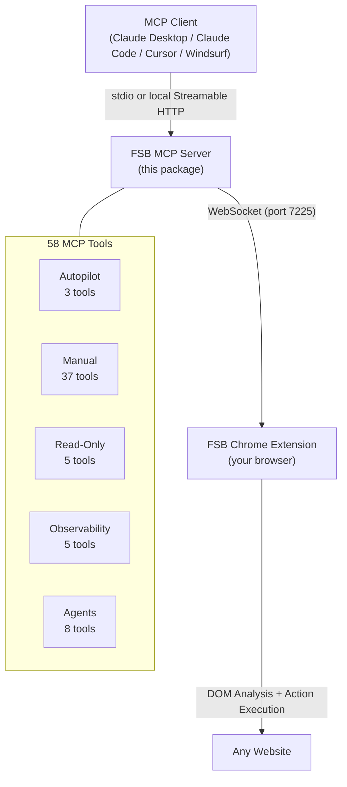

# FSB MCP Server

<div align="center">

<picture>
  <source media="(prefers-color-scheme: dark)" srcset="https://raw.githubusercontent.com/LakshmanTurlapati/FSB/main/assets/fsb_logo_dark.png" />
  <source media="(prefers-color-scheme: light)" srcset="https://raw.githubusercontent.com/LakshmanTurlapati/FSB/main/assets/fsb_logo_light.png" />
  
</picture>


[](https://www.npmjs.com/package/fsb-mcp-server)


[](https://www.npmjs.com/package/fsb-mcp-server)


**Control your browser from any MCP client**

*58 tools for browser automation: manual control, autopilot mode, agents, and full observability*

[Quick Start](#quick-start) | [Tools](#tools-58-total) | [Configuration](#configuration) | [FSB Extension](https://github.com/LakshmanTurlapati/FSB)

</div>

---

## What is this?

FSB MCP Server connects any MCP-compatible AI client (Claude Desktop, Claude Code, Cursor, Windsurf, etc.) to the [FSB Chrome Extension](https://github.com/LakshmanTurlapati/FSB) for browser automation. Control your browser with 58 tools across three operating styles:

- **Manual mode**: fine-grained control with click, type, scroll, navigate, read page content
- **Autopilot mode**: describe a task in natural language and FSB's AI handles every step
- **Agent mode**: create, run, inspect, and manage scheduled background agents from any MCP client

## Prerequisites

- **Node.js 18+**
- **FSB Chrome Extension** installed and active ([install from GitHub](https://github.com/LakshmanTurlapati/FSB))

## Quick Start

### Transport Overview

FSB uses two local endpoints with different roles:

| Endpoint | Purpose |
|----------|---------|
| `ws://localhost:7225` | Existing extension bridge. The browser extension connects here. |
| `http://127.0.0.1:7226/mcp` | Optional local Streamable HTTP MCP endpoint for MCP clients. |

The extension pairing contract did **not** change in `0.6.0`. The local HTTP server is only an additional MCP client entrypoint.

### Claude Desktop

Add to your `claude_desktop_config.json`:

```json
{
  "mcpServers": {
    "fsb": {
      "command": "npx",
      "args": ["-y", "fsb-mcp-server"]
    }
  }
}
```

### Claude Code

```bash
claude mcp add fsb -- npx -y fsb-mcp-server
```

### Cursor

Add to `.cursor/mcp.json`:

```json
{
  "mcpServers": {
    "fsb": {
      "command": "npx",
      "args": ["-y", "fsb-mcp-server"]
    }
  }
}
```

### Windsurf / Other MCP Clients

Any client that supports stdio MCP servers works. The command is:

```
npx -y fsb-mcp-server
```

### Local Streamable HTTP

If your MCP client supports Streamable HTTP, you can run a local HTTP companion instead of a spawned stdio process:

```bash
npx -y fsb-mcp-server serve
```

Default endpoint:

```text
http://127.0.0.1:7226/mcp
```

Health check:

```text
http://127.0.0.1:7226/health
```

### One-Command Install (New)

Auto-configure FSB in any supported MCP client:

```bash
npx -y fsb-mcp-server install --claude-desktop
npx -y fsb-mcp-server install --cursor
npx -y fsb-mcp-server install --vscode
npx -y fsb-mcp-server install --windsurf
npx -y fsb-mcp-server install --cline
npx -y fsb-mcp-server install --zed
npx -y fsb-mcp-server install --gemini
npx -y fsb-mcp-server install --claude-code
npx -y fsb-mcp-server install --codex
npx -y fsb-mcp-server install --continue
```

Install to all detected platforms at once:

```bash
npx -y fsb-mcp-server install --all
```

Preview what would change without writing:

```bash
npx -y fsb-mcp-server install --all --dry-run
```

Remove FSB from a platform:

```bash
npx -y fsb-mcp-server uninstall --cursor
```

### Helpers

```bash
npx -y fsb-mcp-server setup              # Print manual install snippets
npx -y fsb-mcp-server status             # Show bridge and extension status
npx -y fsb-mcp-server status --watch     # Live bridge diagnostics
npx -y fsb-mcp-server doctor             # Diagnose the primary failed layer
npx -y fsb-mcp-server wait-for-extension # Wait for extension to connect
```

### Troubleshooting

When MCP stops working, start with the built-in diagnostics before reinstalling anything:

1. `npx -y fsb-mcp-server doctor`
2. `npx -y fsb-mcp-server status --watch`

Only move on to manual restart or reinstall steps if the reported layer points to package drift, bridge ownership, or extension attachment. If `doctor` reports configuration or content-script trouble, fix that layer first instead of cycling the whole setup.

---

## Tools (58 total)

### Autopilot (3 tools)

Let FSB's AI handle the entire task autonomously.

| Tool | Description |
|------|-------------|
| `run_task` | Execute a browser automation task via natural language. FSB's AI decides the steps. |
| `stop_task` | Cancel the currently running automation task. |
| `get_task_status` | Check task progress, current phase, and ETA. |

### Manual: Navigation (5 tools)

| Tool | Description |
|------|-------------|
| `navigate` | Open a URL in the active tab. Returns final URL after redirects. |
| `search` | Trigger a search on the current page. |
| `go_back` | Navigate back one page in browser history. |
| `go_forward` | Navigate forward one page in browser history. |
| `refresh` | Reload the current page. |

### Manual: Interaction (14 tools)

| Tool | Description |
|------|-------------|
| `click` | Click an element by CSS selector or element reference. |
| `type_text` | Type text into an input field. |
| `press_enter` | Press Enter, optionally on a specific element. |
| `press_key` | Press a key with optional modifiers (ctrl, shift, alt). |
| `select_option` | Select an option from a dropdown. |
| `check_box` | Toggle a checkbox. |
| `hover` | Hover over an element to trigger menus or tooltips. |
| `right_click` | Open context menu on an element. |
| `double_click` | Double-click an element. |
| `select_text_range` | Select a substring within an element by character offsets. |
| `drag_drop` | Drag and drop one DOM element onto another (3-method fallback). |
| `drop_file` | Simulate dropping a file onto a dropzone element. |
| `focus` | Move keyboard focus to an element. |
| `clear_input` | Clear the contents of an input field. |

### Manual: Scrolling (5 tools)

| Tool | Description |
|------|-------------|
| `scroll` | Scroll up or down by a specified amount. |
| `scroll_to_top` | Scroll to the top of the page. |
| `scroll_to_bottom` | Scroll to the bottom of the page. |
| `scroll_to_element` | Scroll a specific element into view. |
| `wait_for_stable` | Wait until the page stops changing (no DOM mutations). |

### Manual: Tabs (2 tools)

| Tool | Description |
|------|-------------|
| `open_tab` | Open a new tab with a URL. Returns the tab ID. |
| `switch_tab` | Switch to a tab by ID. |

### Manual: Spreadsheets (2 tools)

| Tool | Description |
|------|-------------|
| `fill_sheet` | Fill spreadsheet cells with CSV data starting from a given cell. |
| `read_sheet` | Read cell values from a spreadsheet range. |

### Manual: CDP Coordinate Tools (8 tools)

For canvas elements, overlays, and elements where DOM selectors don't work.

| Tool | Description |
|------|-------------|
| `click_at` | Click at viewport coordinates using CDP trusted events. Supports modifiers. |
| `click_and_hold` | Click and hold at coordinates for a duration (long-press, record buttons). |
| `drag` | Drag between two viewport coordinates (canvas drawing, sliders, maps). |
| `drag_variable_speed` | Drag with ease-in-out timing curve (CAPTCHA-resistant, human-like motion). |
| `scroll_at` | Mouse wheel at coordinates (map zoom, canvas zoom). |
| `double_click_at` | Double-click at viewport coordinates using CDP trusted events. |
| `insert_text` | Insert text via CDP into the currently focused editable target. |
| `wait_for_element` | Wait until an element matching a selector appears on the page. |

### Manual: DOM Mutation Helper (1 tool)

| Tool | Description |
|------|-------------|
| `set_attribute` | Set an HTML attribute value on a specific element. |

### Read-Only (5 tools)

These bypass the mutation queue for concurrent access.

| Tool | Description |
|------|-------------|
| `read_page` | Read the text content of the current page. |
| `get_text` | Get text content of a specific element. |
| `get_attribute` | Get an HTML attribute value from an element. |
| `get_dom_snapshot` | Get structured DOM snapshot with element references and selectors. |
| `list_tabs` | List all open tabs with title, URL, and active status. |

### Observability (5 tools)

Inspect past sessions and FSB's learned memory.

| Tool | Description |
|------|-------------|
| `list_sessions` | List all past automation sessions with summary info. |
| `get_session_detail` | Get full session detail: logs, action history, timing. |
| `get_logs` | Get recent logs or session-specific logs with error summary. |
| `search_memory` | Search FSB's memory for past experiences on similar sites. |
| `get_memory_stats` | Get memory system statistics: count, types, storage usage. |

### Agents (8 tools)

Manage and run scheduled background agents directly over MCP.

| Tool | Description |
|------|-------------|
| `create_agent` | Create a new background agent with schedule and start mode. |
| `list_agents` | List all configured background agents. |
| `run_agent` | Trigger immediate execution of an agent. |
| `stop_agent` | Stop a currently running agent execution. |
| `delete_agent` | Permanently delete an agent. |
| `toggle_agent` | Enable or disable an agent. |
| `get_agent_stats` | Get aggregate stats across all agents. |
| `get_agent_history` | Get recent run history for one agent. |

---

## Configuration

The MCP server communicates with the FSB Chrome Extension over a local WebSocket connection on port **7225**. No configuration is needed for the extension bridge; just make sure the extension is installed, enabled, and the browser is running.

If you run local Streamable HTTP mode, the MCP client talks to `http://127.0.0.1:7226/mcp` by default while the extension continues to use `ws://localhost:7225`.

### How it works



### Hub/Relay Architecture

FSB still uses the same local bridge contract:

- The MCP client talks to this package over stdio or Streamable HTTP
- This package talks to the extension over `ws://localhost:7225`
- The browser extension remains unchanged

This keeps installation simple while avoiding any MCP-specific changes inside the extension.

Multiple MCP clients can connect simultaneously. The first server instance becomes the **hub** (listens on port 7225). Additional instances connect as **relay clients** to the hub. If the hub disconnects, a relay automatically promotes to hub.

---

## Resources

The server also exposes 5 live MCP resources:

| Resource | URI | Description |
|----------|-----|-------------|
| Current Page DOM | `browser://dom/snapshot` | Structured DOM with element references |
| Open Tabs | `browser://tabs` | All tabs with title, URL, active status |
| Site Guides | `fsb://site-guides` | Domain-specific automation intelligence |
| FSB Memory | `fsb://memory` | Learned patterns from past sessions |
| Extension Config | `fsb://config` | Current settings and connection status |

---

## Links

- [FSB Chrome Extension](https://github.com/LakshmanTurlapati/FSB): the browser extension this server connects to
- [Issues](https://github.com/LakshmanTurlapati/FSB/issues): report bugs or request features
- [License](https://github.com/LakshmanTurlapati/FSB/blob/main/LICENSE): MIT

---

<div align="center">

<picture>
  <source media="(prefers-color-scheme: dark)" srcset="https://raw.githubusercontent.com/LakshmanTurlapati/FSB/main/assets/fsb_logo_dark_footer.png" />
  <source media="(prefers-color-scheme: light)" srcset="https://raw.githubusercontent.com/LakshmanTurlapati/FSB/main/assets/fsb_logo_light_footer.png" />
  
</picture>

*Built by [Lakshman Turlapati](https://github.com/LakshmanTurlapati)*

</div>
